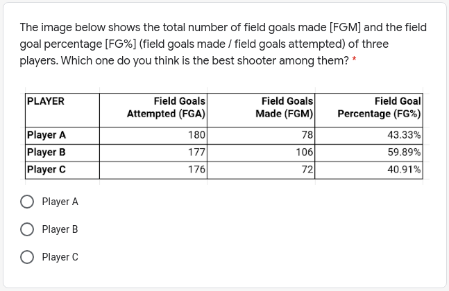
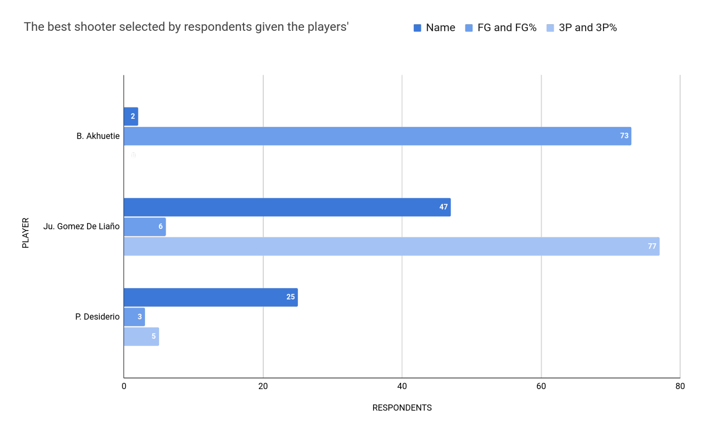
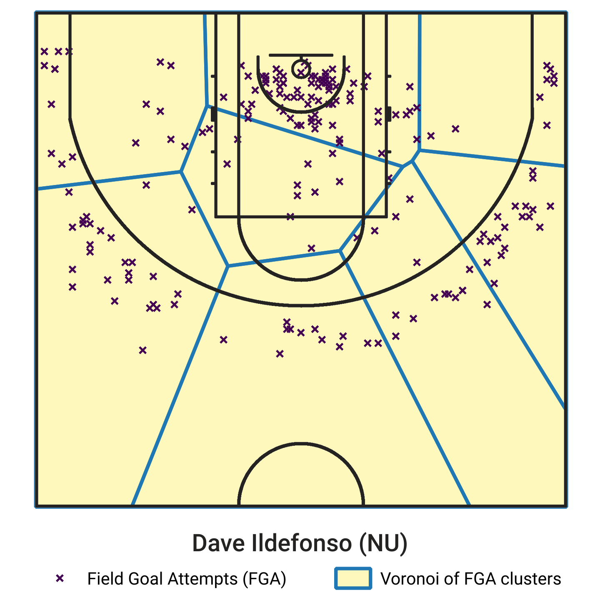
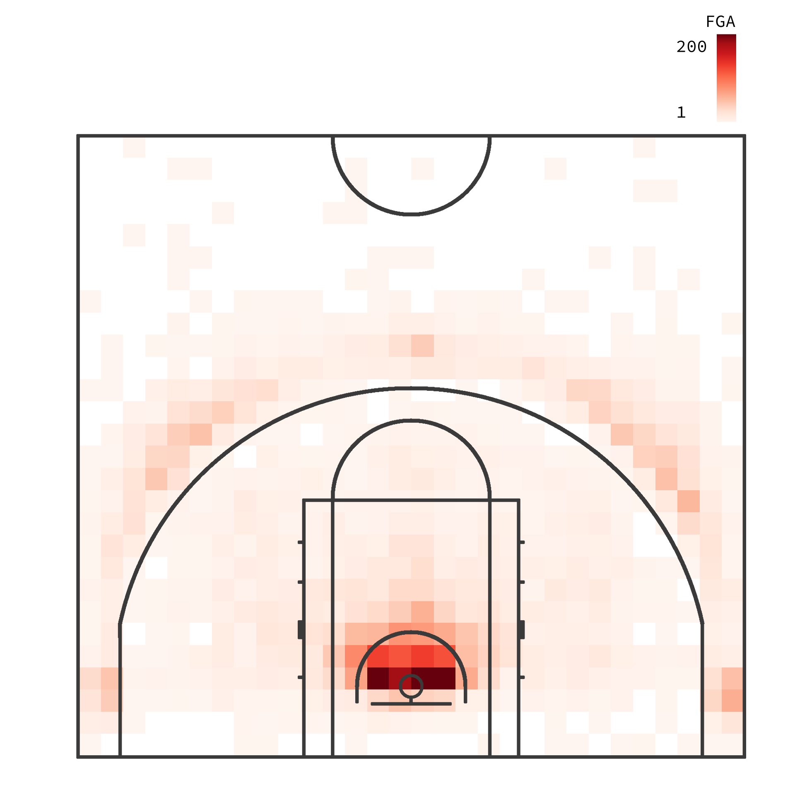
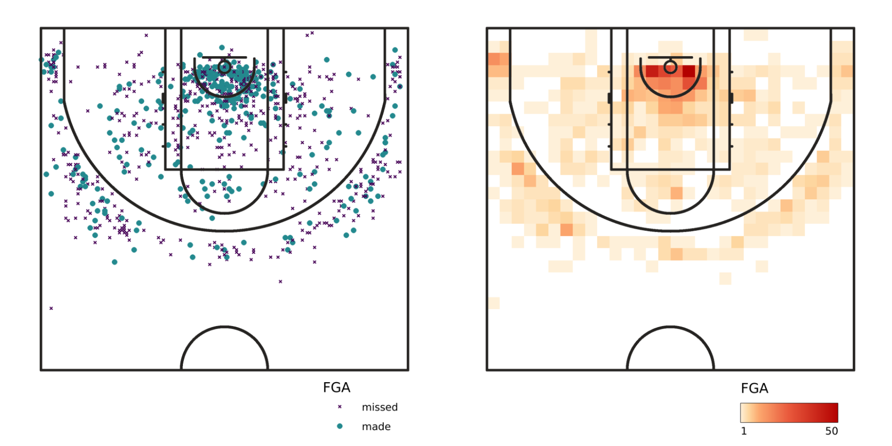
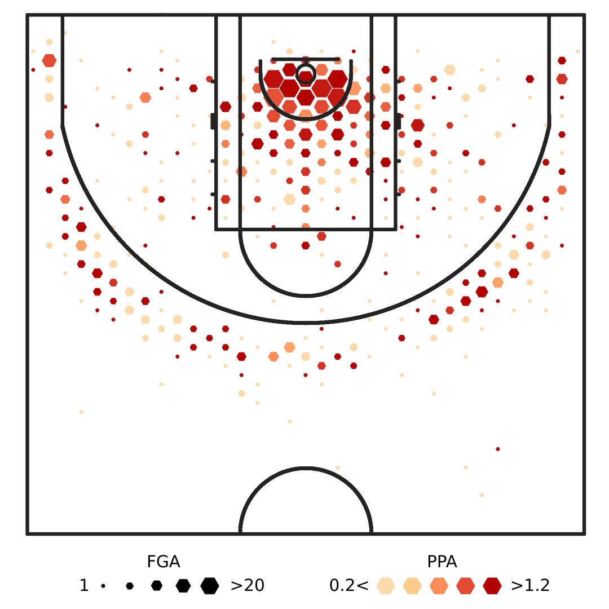
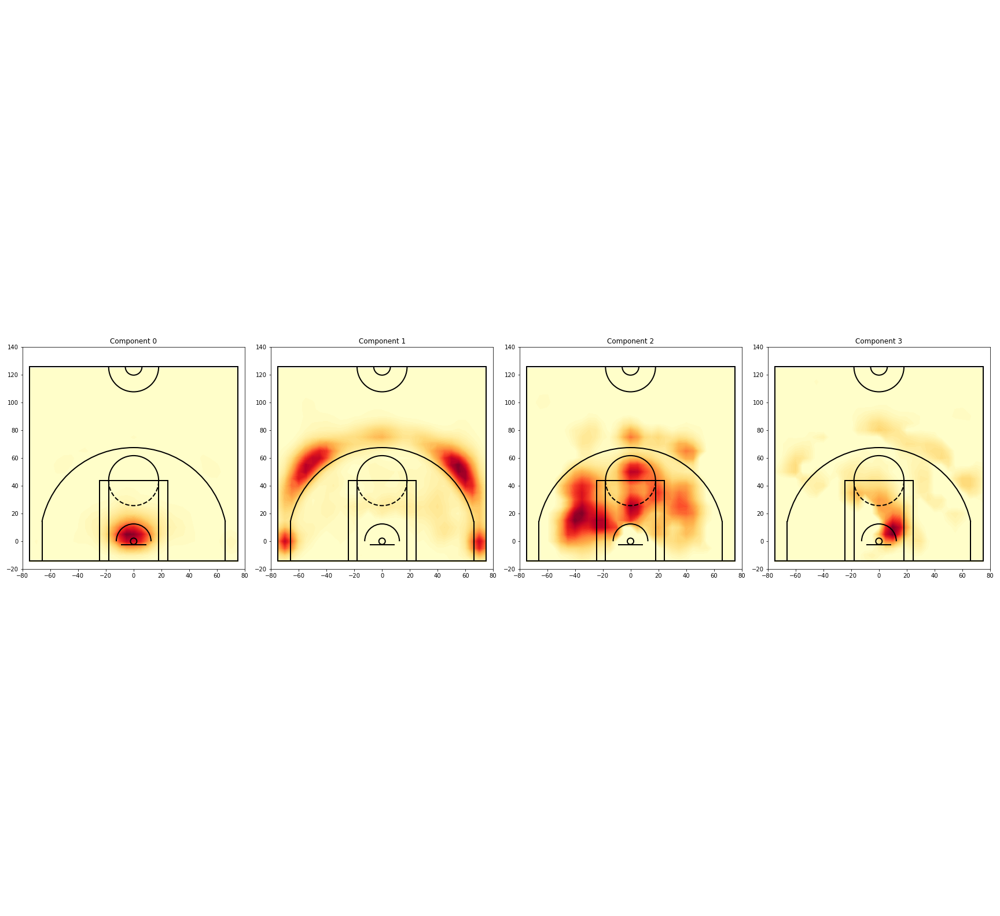
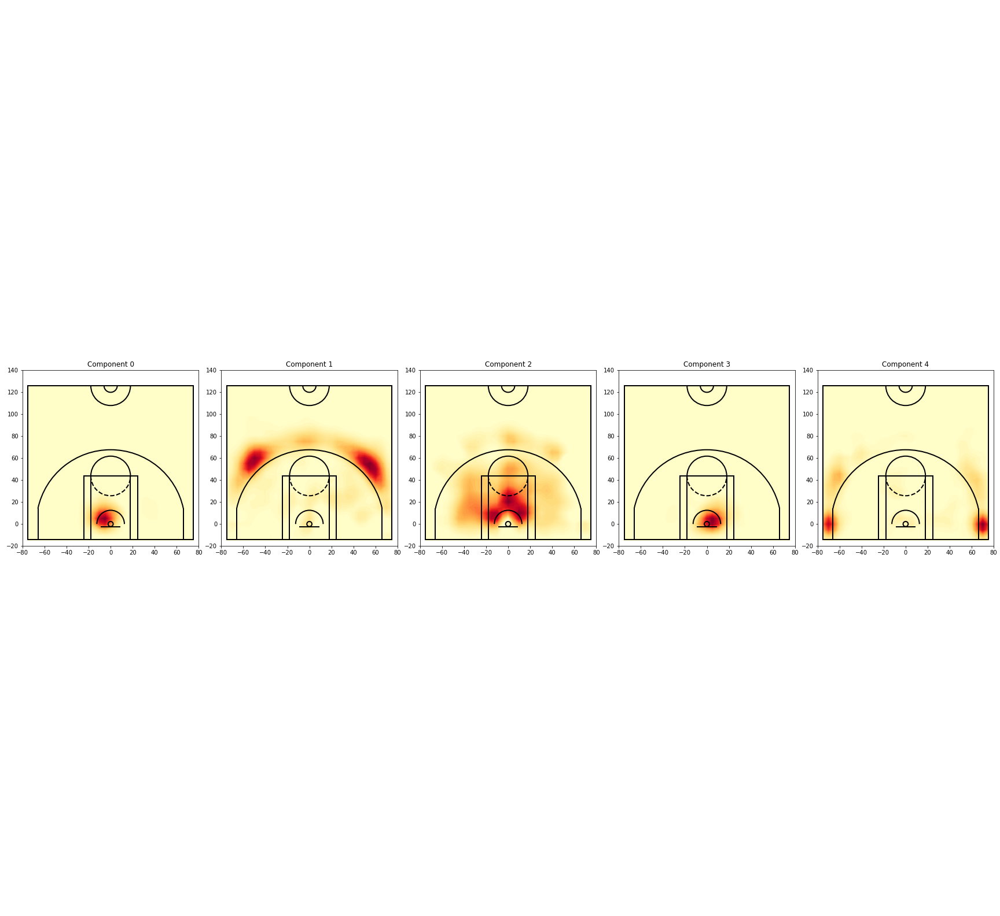
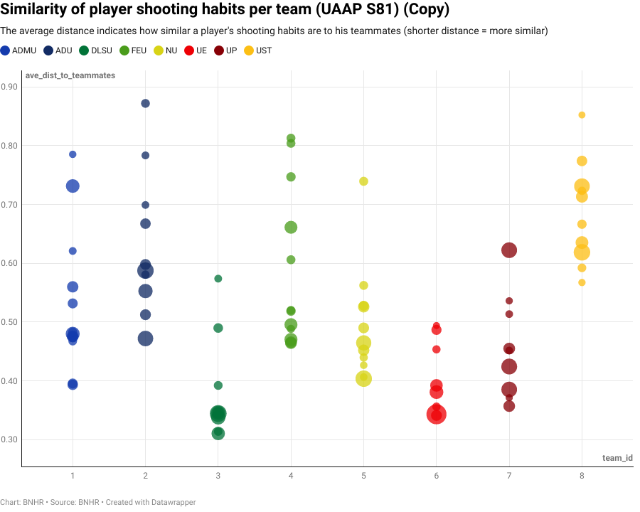

1.         Introduction {#h.j3efbxlfynao .c90 .c45}
=======================

1.1        Background {#h.q98swz9jcgvy .c16}
---------------------

Basketball is spatial. Any event that occurs during a basketball game—a
made shot, a missed shot, a rebound—has a corresponding spatial or
spatio-temporal information embedded in it and, one can argue, that
location oftentimes plays an important role in its occurrence or
success.

If you think of the basketball court as a map, a parcel of the earth, or
simply a cartesian coordinate plane then every location on the court can
be specified by a coordinate pair. If we consider one type of basketball
event—a shot or field goal—every occurrence of this event on the court
will have its own corresponding coordinates. Aside from coordinates,
these field goals can also have attributes or marks—the name of the
player, the name of the team, the opponent, the time left on the clock,
whether the shot was made or not, whether it was defended—that provide
other information about the field goal. If we take this collection of
field goals, what we actually have is a collection of points in space
that is, similar to any spatial point dataset, susceptible to spatial
analysis. This is why it makes sense to analyze basketball from a
spatial perspective.

The advent of player tracking systems in basketball such as the SportVU
Player Tracking System used in the National Basketball Association (NBA)
has enabled research and studies that use location data to create a
deeper understanding of the spatial nature of the game and even
challenge conventional wisdom. Optical tracking data has been used to
study shooting and introduce spatially-aware metrics for analysing
shooting tendencies and potency—metrics like Spread and Range
(Goldsberry, 2012) that measure how much of the court a player shoots
and scores from, Spatial Shooting Effectiveness (SSE) and Points Over
League Average (POLA) (Shortridge et al., 2014) that compare a player’s
actual and expected scoring performance based on the spatial
distribution of his shots, and Lineups Points Lost (LPL) (Sandholtz et
al., 2019) that looks at field goals as an optimal allocation problem
and computes the difference between what a five-man lineup is expected
to score if they optimized their choice of field goals versus what the
same five-man lineup actually scores. Spatial analysis has also been
used to study and deconstruct rebounding with new metrics for
positioning, hustle, and conversion of rebounds generated using a
Voronoi-tessellation approach combined with a spatial probability
distribution (Maheswarean et al., 2012; Maheswaran et al., 2014).
Defense has also been studied (Goldsberry et al., 2013; Franks et al.,
2015) as well as the effects of player motion on creating open shots
(D’Amour et al., 2015). Optical tracking data has even been used to
determine the value of different areas on the court (Cervone et al.,
2016a) and predict the outcomes of basketball possessions (Cervone et
al., 2016).

Truly, the application of spatial analysis in basketball has added a new
dimension to how we view the game.

1.2        Basketball analysis in the Philippines {#h.qlge0cpcyxga .c16}
-------------------------------------------------

Advanced and spatial analytics do not seem to be part of mainstream
basketball analysis in the country as evidenced by the lack of available
data and information released by popular basketball leagues such as the
Philippine Basketball Association (PBA), Maharlika Pilipinas Basketball
League (MPBL), University Athletics Association of the Philippines
(UAAP), and National Collegiate Athletics Association (NCAA). Compared
to the NBA which releases a wide variety of statistics in its Official
NBA Stats website
([https://www.nba.com/stats/](https://www.google.com/url?q=https://www.nba.com/stats/&sa=D&source=editors&ust=1634968640581000&usg=AOvVaw03plyquynZq8aqK49XIu2J))
and in other sites such as Basketball Reference
([https://www.basketball-reference.com/](https://www.google.com/url?q=https://www.basketball-reference.com/&sa=D&source=editors&ust=1634968640581000&usg=AOvVaw3hA7ytW7P0McZC-eSXbzXT)),
it’s hard to find any publicly available advanced statistics websites
for Philippine basketball—one example is HumbleBola
([https://twitter.com/humblebola\_](https://www.google.com/url?q=https://twitter.com/humblebola_&sa=D&source=editors&ust=1634968640581000&usg=AOvVaw1I7eCxtsOBfEbajuCu0eEI))
although at the time of this writing, their website
([https://humblebola.com](https://www.google.com/url?q=https://humblebola.com&sa=D&source=editors&ust=1634968640582000&usg=AOvVaw2mdX2RvSP-EX9dnkpW8bxX))
is no longer available. Meanwhile, websites of mainstream media outlets
such as ABS-CBN that cover collegiate basketball leagues and the
official PBA
([https://www.pba.ph/stats](https://www.google.com/url?q=https://www.pba.ph/stats&sa=D&source=editors&ust=1634968640582000&usg=AOvVaw1fFw4fcrCSFsUbiqdbX9zE))
and MPBL
([https://mpbl.web.geniussports.com/competitions/](https://www.google.com/url?q=https://mpbl.web.geniussports.com/competitions/&sa=D&source=editors&ust=1634968640583000&usg=AOvVaw3r0r5gst-Pnc4lHErX4Ct8))
websites only show basic counting and rate statistics such as the number
of field goals, field goal percentage, etc.

That’s not to say that analytics isn’t used in Philippine basketball. An
article by Socamos (2018) highlighted the use of data and analytics by
the Alaska Aces in the PBA and the National University Bulldogs in the
UAAP. Another article by Murillo (2019) mentioned  that “while use of
sports analytics in the Philippines is acknowledged to be still in its
infancy, it has nonetheless made in-roads with more teams and
organizations recognizing its value and potential” noting that  in the
PBA, the Alaska Aces and the Ginebra San Miguel Kings were using sports
analytics with designated personnel. The same article stated that
“despite the pickup that sports analytics has gained in the
Philippines,... its appreciation and use of it are still a way off as
compared to those in other countries, especially in those with readily
available technology and equipment” (Murillo, 2019). In the UAAP,
personal correspondence with individuals who work on managing the UP
Fighting Maroons Men’s Basketball Team informed me that the team uses a
combination of videos and statistics in their game preparation and
analysis.

1.3        Incorporating the spatial nature of shooting {#h.seg7tbd0tmcb .c16}
-------------------------------------------------------

Players shoot differently at different locations on the court and this
variation has effects on how players are rated, how they are trained,
and how teams create strategies. Conventional shooting statistics such
as the number of made field goals or the field goal percentage that do
not account for the spatial nature of shooting provide incomplete and,
at times, incorrect information about the phenomenon that can lead to
incorrect conclusions.

Take for example two players who both attempted 100 field goals over the
course of a season—Player A shot 50% from the court and Player B shot
40% from the court. When only this information is provided, it may be
assumed that Player A is a better shooter than Player B but this
conclusion fails to consider that the two players may not be shooting
from the same locations on the court. This is problematic because there
are several instances when Player B can be considered a better shooter
than Player A in this scenario. One example is when Player A is only
taking two-pointers and thus scoring 1 point per attempt while Player B
is only taking three-pointers and thus scoring 1.2 points per attempt,
outscoring Player A by 0.2 points with every shot. Another example is
when Player A takes shots at areas where other players average shooting
60% from while Player B takes shots from areas where other players
average shooting 33% from. This means that Player A is actually a
below-average shooter while Player B is an above-average one.

        What makes a good shooter? Is it someone who simply makes a high
percentage of his shots like a center or power forward who dominates the
interior but rarely takes shots outside the paint? Is it someone who can
make shots that are far from the basket, a three-point specialist
perhaps? Or is it someone who is a threat to score everywhere on the
court even though they may not shoot particularly well overall? When
answering this question, conventional statistics such as FG%, 3P%, PPA,
eFG, and TS% provide a generalized version of a player's shooting or
scoring ability but they don't provide context as to the locations where
players shoot and how well they shoot at these locations. This is
disappointing because, when you think about it, being able to pinpoint
where a player or team scores is a powerful tool to have when creating
basketball strategies and game plans.

        As part of the research, a survey shown in Figure 1.1 was
conducted where respondents were asked to select who they thought was
the best shooter among three players. They weren’t explicitly told that
they were selecting from the same three players in all the questions and
in each of the questions, only some information was shown to them.  In
the first question they were given just names of players; in the second,
the FG and FG% of the players; and in the third, the 3P and 3P% of the
players. Table 1.1. summarizes the players and their shooting
statistics.

Figure 1.1

Questions in the “Who is the best shooter?” survey

+-----------+-----------+-----------+-----------+-----------+-----------+-----------+-----------+
| player    | team      | 2PA       | 2P        | 2P%       | 3PA       | 3P        | 3P%       |
|           |           |           |           |           |           |           |           |
|           |           | \# of 2pt | \# of 2pt | 2P / 2PA  | \# of 3pt | \# of 3pt | 3P / 3PA  |
|           |           | FGs       | FGs made  |           | FGs       | FGs made  |           |
|           |           | attempted |           |           | attempted |           |           |
+-----------+-----------+-----------+-----------+-----------+-----------+-----------+-----------+
| B.        | UP        | 174       | 106       | 0.6092    | 3         | 0         | 0.0000    |
| Akhuetie  |           |           |           |           |           |           |           |
+-----------+-----------+-----------+-----------+-----------+-----------+-----------+-----------+
| Ju. GDL   | UP        | 107       | 55        | 0.5140    | 73        | 23        | 0.3151    |
+-----------+-----------+-----------+-----------+-----------+-----------+-----------+-----------+
| P.        | UP        | 95        | 48        | 0.5003    | 81        | 24        | 0.2963    |
| Desiderio |           |           |           |           |           |           |           |
+-----------+-----------+-----------+-----------+-----------+-----------+-----------+-----------+

+------------+------------+------------+------------+------------+------------+------------+
| player     | team       | FGA        | FG         | FG%        | eFG%       | PPA        |
|            |            |            |            |            |            |            |
|            |            | \# of  FGs | \# of FGs  | FG / FGA   | (FG + 0.5  | ((2 \* 2P) |
|            |            | attempted  | made       |            | \* 3P) /   | + (3 \*    |
|            |            |            |            |            | FGA        | 3P)) / FGA |
+------------+------------+------------+------------+------------+------------+------------+
| B.         | UP         | 177        | 106        | 0.5989     | 0.5989     | 1.20       |
| Akhuetie   |            |            |            |            |            |            |
+------------+------------+------------+------------+------------+------------+------------+
| Ju. GDL    | UP         | 180        | 78         | 0.4333     | 0/4972     | 0.99       |
+------------+------------+------------+------------+------------+------------+------------+
| P.         | UP         | 176        | 72         | 0.4091     | 0.4773     | 0.95       |
| Desiderio  |            |            |            |            |            |            |
+------------+------------+------------+------------+------------+------------+------------+

Table 1.1

Shooting statistics of B. Akhuetie, Ju. Gomez de Liaño, and P. Desiderio
for UAAP S81

        The results of the survey were interesting in that the
respondents rarely selected the same player for all three questions.
Only 3/82 selected the same player in all three questions while 32/82
selected a different player for each of the questions. They were
consistent in choosing the player with the best percentage as the best
shooter. More than 90% of the time they selected the player with the
best FG% in question 2 (73/82) and the best 3P% in question 3 (77/82)
even though these were 2 different players.

        Figure 1.2 shows the results of the survey while Figure 1.3
shows a shot chart of the three players.

Figure 1.2

The best shooter as chosen by respondents

Figure 1.3

Shot chart of Bright Akhuetie, Juan GDL, and Paul Desiderio for UAAP S81

Bright was almost always selected as the best shooter when the
respondents were only shown the Field Goal information as was the case
with Juan in the question showing 3P information, but an interesting
observation is that Desiderio was selected as the best shooter 25x just
from name alone but was not selected more than 5x when the respondents
were shown statistics -- probably a testament to the effect that
reputation has when assessing players.

It’s also worth noting that a lot of the respondents chose “Someone who
can make a high percentage of his shots from different areas on the
court.” as their definition of a good shooter. This can be the reason
why Bright was almost never chosen as the best shooter for questions 1
and 3. He had no 3P game to speak of as seen in the statistics and the
distribution of his field goals. So even though he had the best metrics
among the players in all but 3P shooting, respondents rarely chose him
as their best shooter just from his name alone.

Conventional shooting statistics also have trouble differentiating
players with similar shooting statistics. Table1.2 shows the shooting
statistics of Paul Desiderio, Dave Ildefonso, and Sean Manganti—players
of UP, NU, and Adamson respectively in Season 81. If you look at their
stats, they are practically the same players with similar number of
attempts, percentages, and metrics across the board. This might lead
people to believe that they also shoot the same way but this isn’t the
case.

+-----------+-----------+-----------+-----------+-----------+-----------+-----------+-----------+
| player    | team      | 2PA       | 2P        | 2P%       | 3PA       | 3P        | 3P%       |
|           |           |           |           |           |           |           |           |
|           |           | \# of 2pt | \# of 2pt | 2P / 2PA  | \# of 3pt | \# of 3pt | 3P / 3PA  |
|           |           | FGs       | FGs made  |           | FGs       | FGs made  |           |
|           |           | attempted |           |           | attempted |           |           |
+-----------+-----------+-----------+-----------+-----------+-----------+-----------+-----------+
| P.        | UP        | 95        | 48        | 0.5003    | 81        | 24        | 0.2963    |
| Desiderio |           |           |           |           |           |           |           |
+-----------+-----------+-----------+-----------+-----------+-----------+-----------+-----------+
| D.        | NU        | 110       | 57        | 0.5182    | 85        | 23        | 0.2706    |
| Ildefonso |           |           |           |           |           |           |           |
+-----------+-----------+-----------+-----------+-----------+-----------+-----------+-----------+
| S.        | ADU       | 106       | 56        | 0.5283    | 66        | 15        | 0.2273    |
| Manganti  |           |           |           |           |           |           |           |
+-----------+-----------+-----------+-----------+-----------+-----------+-----------+-----------+

+------------+------------+------------+------------+------------+------------+------------+
| player     | team       | FGA        | FG         | FG%        | eFG%       | PPA        |
|            |            |            |            |            |            |            |
|            |            | \# of  FGs | \# of FGs  | FG / FGA   | (FG + 0.5  | ((2 \* 2P) |
|            |            | attempted  | made       |            | \* 3P) /   | + (3 \*    |
|            |            |            |            |            | FGA        | 3P)) / FGA |
+------------+------------+------------+------------+------------+------------+------------+
| P.         | UP         | 176        | 72         | 0.4091     | 0.4773     | 0.95       |
| Desiderio  |            |            |            |            |            |            |
+------------+------------+------------+------------+------------+------------+------------+
| D.         | NU         | 195        | 80         | 0.4103     | 0.4692     | 0.94       |
| Ildefonso  |            |            |            |            |            |            |
+------------+------------+------------+------------+------------+------------+------------+
| S.         | ADU        | 172        | 71         | 0.4128     | 0.4564     | 0.91       |
| Manganti   |            |            |            |            |            |            |
+------------+------------+------------+------------+------------+------------+------------+

Table 1.2

Shooting statistics of P. Desiderio, D. Ildefonso, and S. Manganti for
UAAP S81

        Figure 1.4 shows a Voronoi tessellation of the players’ field
goals using the mean coordinate of clusters computed using a K-means
clustering with K=8. From these images, the nuances in their shooting
styles that are not readily apparent from the conventional statistics
can be seen. Paul’s clusters are fairly symmetrical, Dave has a cluster
of shots near the basket, while Sean has left and right clusters for
shots in the paint. These maps show that even though the three players
have similar shooting statistics, they have, in fact, different habits
of shooting.

Figure 1.4

Field goal clusters and voronoi of P. Desiderio (top-left), D. Ildefonso
(top-right), and S. Manganti (bottom) for UAAP S81

1.4        Overview of the research {#h.wgi51f2xh0f6 .c16}
-----------------------------------

The current state of basketball analysis in the Philippines provides an
opportunity to utilize spatial analysis techniques in Philippine
basketball and show not only that it can be done but also its
applications in evaluating the abilities and performance of players and
teams.

        This research provides methods and metrics for analyzing,
visualizing, and describing scoring in Philippine
basketball—particularly the UAAP—in a manner that explicitly accounts
for the spatial nature of shooting. It utilizes a matrix decomposition
algorithm known as Non-negative Matrix Factorization (NMF) to divide the
court into areas or shooting zones where field goals are commonly taken
and provide information about how frequently players shoot from these
shooting zones. Using this information, players are grouped and compared
according to their shooting habits. It also presents spatial metrics to
evaluate shooting, scoring, and defense that build on the SSE and POLA
metrics introduced by Shortridge (2014). These metrics measure the
scoring effectiveness at different locations on the court by comparing
the expected number of points scored and the actual points scored at
these locations.

Finally, the research applies these methods and metrics to a case study
of the UAAP Men’s Basketball Tournament (Season 81) and showcases the
value of spatial analysis in evaluating teams, players, and winning in
basketball.

1.5        Research objectives {#h.usdphhj9tl1d .c16}
------------------------------

The general goal of this research is to display and highlight the value
of spatial analysis as applied in Philippine basketball. To meet this
goal, the specific objectives of this research are:

1.  To divide the court into shooting areas stochastically by using the
    spatial dataset of field goals to find commonly occurring patterns
    of where field goals are taken;
2.  To group similar players based on their shooting tendencies;
3.  To generate spatially-aware metrics of shooting and show how they
    can be applied to analyze players and teams; and
4.  To create and share a spatial dataset of field goals that can be
    used for future research.

        

1.6        Thesis structure {#h.ny5jvyowjrht .c16}
---------------------------

This thesis is divided into five chapters. Chapter 1 provides a
background of how spatial analysis has been used to study basketball
abroad, the current use of analytics in Philippine basketball, and
presents the overview and objectives of the study. Chapter 2 gives a
review of relevant literature on the use of spatial analysis in
Philippine basketball, the spatial characterization of field goals using
Non-negative Matrix Factorization, and different spatial metrics of
shooting. Chapter 3 describes the scope and delimitation of the study,
the dataset used, the methods employed, and the spatial metrics
generated. Chapter 4 presents a case study applying the methods and
metrics generated by the research on the UAAP MBT (Season 81) and
provides a detailed discussion of the results. Chapter 5 gives the
summary and conclusions of the study and outlines recommendations for
future research. The remaining sections contain the references,
appendices, glossary of terms, and other supplementary materials related
to the study.

* * * * *

 {#h.pgme33fgvwvx .c45 .c76}

2.         Review of Literature {#h.4zcb5wwzdcf9 .c90 .c45}
===============================

A review of methods for quantifying and characterizing basketball
gameplay for both the player and team level is given by Tenner and
Franks (2020) but most of the literature pertains to studies using data
from the National Basketball Association (NBA). Although it was noted
that most of the methods discussed there were relevant across all
basketball leagues, looking at the current body of work around the
spatial analysis of basketball, it becomes apparent that such studies
are not, if rarely, done in the Philippine context.

2.1        Spatial analysis of Philippine basketball {#h.3wxmvwuznm7u .c16}
----------------------------------------------------

The use of spatial analytics in mainstream Philippine basketball is not
as common as it is abroad. This can be attributed to the lack of readily
available spatial data that is needed for spatial analysis. Basketball
leagues in the Philippines either do not have player tracking data or
they do not share it publicly.

One study that looked at the entire pipeline of spatial analysis for
Philippine basketball—from data extraction, storage, analysis, and
presentation—was CourtVisionPH by Pintor and Cataniag (2014). Due to the
unavailability of field goal location data, CourtVisionPH relied on
extracting shooting locations from broadcast basketball videos by
utilizing the concept of transformation between two coordinate reference
systems—that is, the coordinates on the video frame where a shot is
taken can be mapped to its corresponding location on a model of the
basketball court whose dimensions and coordinates are known. The system
took advantage of the fact that a regulation basketball court has a
standard size and that there are easily-distinguishable markings on the
court that could serve as control points for solving the coordinate
transformation problem. These points included the corners of the
baseline, intersections of court lines, the corners of the paint, and
other markings whose positions on the court are known. After extracting
the field goal locations, the data was stored in a database and spatial
metrics were computed and visualized.  Figure 2.1 details the
CourtVisionPH system.

Figure 2.1

The CourtVisionPH System (Pintor and Cataniag, 2014)

Note: The system was divided into three primary modules: a data
extraction, data storage, and data analysis/visualization module. Field
goal data is extracted semi-automatically from a video source and stored
in a database. The data analysis and visualization module uses the
stored data to perform queries, compute metrics, and generate maps.

Although crude, CourtVisionPH demonstrated that the spatial analysis of
shooting is possible in the Philippine context. The system has
received some updates since its release notably the use of a spatial
database and existing geospatial applications such as QGIS for the
analysis and presentation instead of the original standalone
analysis/visualization application. At the time when CourtVisionPH was
created, the Spread and Range metrics first introduced by Goldsberry
(2012) and used by the system were still considerably novel but since
then, the number of researches and studies that applied spatial analysis
to shooting have grown and newer methods and metrics have been
introduced. Some of these methods and metrics are discussed in the next
section.

2.2        Spatial characterization of field goals {#h.fvz4pxlq3j5h .c16}
--------------------------------------------------

Dividing the court into shooting zones or hot zones is a common
technique used to analyze shooting. Using this approach, analysts can
compute and compare how players and teams shoot at predefined partitions
of the court. Most of the time however, the way the court divisions are
defined is arbitrary and dependent on the person doing the analysis.
Even though common court divisions include general areas such as the
paint, the mid-range area, the three-point area, the restricted area,
the non-restricted area in the paint, the left and right baseline, the
left and right block to elbow, the key, the top of the key
three-pointer, the left and right wing three-pointers, the corner
three-pointers, the way these areas  are delineated on the court still
vary.  Figure 2.2 shows how these general areas can be divided
differently on the court.

+--------------------------------------+--------------------------------------+
|               |               |
+--------------------------------------+--------------------------------------+

Figure 2.2

Shooting zone divisions (Top: FIBA LiveStats; Bottom: NBA)

Note: The FIBA LiveStats and NBA divisions partition the court into the
same general areas but do so differently.

Although there is value in having predefined court divisions, we can’t
definitely say that these divisions characterize the shooting patterns
present in a field goal dataset. What these divisions represent is an
idealized version of where and how we think field goals will be grouped
together before the fact but once players start taking shots, the actual
patterns of these field goals and areas where they are commonly taken
might partition the court differently. In order to characterize where
players take shots and how frequently they take them, a data-driven
approach that divides the court based on patterns in the field goal
dataset is needed.

        Finding patterns in spatial datasets can be done using
clustering algorithms like K-means clustering or matrix decomposition
algorithms like Principal Component Analysis (PCA) or Singular Value
Decomposition (SVD). In recent years, the process of Non-negative Matrix
Factorization (NMF) has gained traction in basketball analytics for its
ability to divide the court into parts and provide an approximation of
players’ shooting habits in those parts.

### 2.2.1        Finding spatial basis vectors using Non-negative Matrix Factorization {#h.7w1yvkuhm6p8 .c10}

Non-negative Matrix Factorization or NMF is a matrix decomposition
algorithm that assumes some non-negative matrix V can be approximated by
the product of two lower-rank non-negative matrices W and B where as
seen in (2.1).

                                         (2.1)

        The matrix is composed of N data points
each of length X, the basis loadings or weight matrix
 consists of N non-negative weight vectors, and
the basis matrix  contains K basis vectors. Each
data point in V can be reconstructed using a combination of W and B.
(Miller, 2014)

A distinct characteristic of NMF is that it constrains all of its
component matrices to be non-negative. Because of this, the resulting
basis vectors B tend to be disjoint and exhibit a “parts-based”
decomposition that corresponds to frequently occurring patterns in the
sample. This has the advantage of avoiding the cancellation phenomenon
exhibited by other non-constrained matrix factorization methods like
PCA. This restrictive property of NMF also results in sparser and more
interpretable basis vectors. (Lee & Seung, 1999)

In the case of basketball, using NMF to decompose a field goal dataset
makes sense due to the following reasons: first, the field goal
matrix—or the collection of field goals at different locations on the
court—is always non-negative because it is impossible to attempt a
negative number of shots; second, the outputs of NMF correspond
intuitively to basketball concepts. The spatial basis vectors in B can
be interpreted as disjoint sub-intensities or parts that represent
shot-types or shooting zones on the court. Meanwhile, the player weights
in W can be used to summarize the spatial shooting habits of individual
players inside the spatial basis vectors in B (Miller et al., 2014;
Franks et al., 2015).

The general steps in applying NMF for deconstructing field goals (Miller
et al., 2014;  Franks et al., 2015; Jiao et al., 2020) are:

1.  Discretize the court using a regular tessellation into X shooting
    cells.
2.  Construct a count matrix C where Cnx = the number of field goals by
    player k in cell x.
3.  Fit an intensity surface for each player k
    over the discretized court.
4.  Construct the data matrix (field goal matrix)
    where has been
    normalized such that it has a unit volume.
5.  Solve the optimization problem  where W and
    B are lower-rank matrices and all matrices are non-negative.

        To fit the intensity surface of a player’s field goals, Miller
et al. (2014) and Franks et al. (2015) modeled them as a Log Gaussian
Cox Process (LGCP) after discretizing the court into 1 square foot tiles
to gain computational tractability in fitting the LGCP surfaces.
Meanwhile, Jiao et al. (2020) used a kernel estimation “which is easier
to compute and more accurate in the sense of intensity fitting
accuracy”.

Figure 2.3 (Miller et al., 2014) shows a comparison of the resulting
basis vectors generated by NMF with LGCP-fitted intensity surfaces using
the (a) Kullback-Leibler (KL) and (b) Frobenius loss functions, (c) NMF
with a discrete dataset, and (d) PCA with the LGCP-fitted intensity
surfaces.

Figure 2.3

Visual comparison of basis resulting from various dimensionality
reduction approaches.

Note: From “Factorized Point Process Intensities: A Spatial Analysis of
Professional Basketball,” by A. Miller et al., 2014, Proceedings of The
31st International Conference on Machine Learning (ICML14), Beijing,
China, June 22-24, 2014. Journal of Machine Learning Research: W&CP 32:
235-243.

The KL-based NMF resulted in a “more spatially diverse basis” compared
to the Frobenius-based one which focused on “high-intensity areas near
the basket” at the expense of other areas on the court. This can be
attributed to the difference between the KL loss function—which includes
a log ratio term that disallows large ratios between the original and
reconstructed matrices—and the Frobenius loss function—which does not
include a log ratio term and thus only disallows large differences.
Meanwhile, the PCA basis vectors were uninterpretable as parts of the
court due to the bases being unconstrained real numbers. The corner
three-point feature that was salient in the LGCP-NMF decompositions
appeared in several PCA vectors with positive and negative values that
exhibited the cancelation phenomenon with PCA that NMF avoids (Miller et
al., 2014).  Subsequent studies using NMF (Franks et al., 2015;
Sandholtz et al., 2019; Jiao et al., 2020) also used the KL loss
function.

The LGCP-NMF method discovered a “shots-based decomposition” of NBA
players where the resulting basis vectors B corresponded to “visually
interpretable shot types”—one basis corresponded to corner three-point
shots, another to wing three-point shots, and yet another to top of the
key three point shots, etc.—while the player specific basis weights in
W provided a concise characterization of  player’s offensive habits. The
weight wnk can be interpreted as the “amount player k takes shot type
k”. (Miller et al., 2014)

Miller et al. (2014) also showed that, after a certain K, the low-rank
NMF reconstructions had better predictive performance than independent
LGCPs for player data with 10% of the shots held out. Figure 2.4 (Miller
et al., 2014) shows the predictive likelihood for independent LGCP and
LGCP-NMF at varying K.

Figure 2.4

Predictive Likelihood (10-fold cv) of LGCP and LGCP-NMF at varying K

Note: From “Factorized Point Process Intensities: A Spatial Analysis of
Professional Basketball,” by A. Miller et al., 2014, Proceedings of The
31st International Conference on Machine Learning (ICML14), Beijing,
China, June 22-24, 2014. Journal of Machine Learning Research: W&CP 32:
235-243.

The K values with better predictive performance can be used as the
K values for the NMF decomposition. Miller et al. (2014) and Jiao  et
al. (2014) used K=10 while Franks et al. (2015) used K=6.

Aside from using a lower number of bases, Franks et al. (2015) also
discarded a residual basis from the six computed by NMF since, unlike
PCA, NMF is not mean-centered and a residual basis appears regardless of
the value of K. This residual basis captures the positive intensities
outside the support of the relevant bases and is therefore not used in
the analysis. Figure 2.5 (Franks et al., 2015) shows the spatial bases
 identified using LGCP-NMF with K=6.

 Similar to Miller et al. (2014), Franks et al. (2015) also arrived at a
“shot-based decomposition of NBA players” where the bases corresponded
to shots in the restricted area (Basis 1), shots from the rest of the
paint (Basis 2), mid-range shots (Basis 3), corner three-point shots
(Basis 4), and center three-point shots (Basis 5).

Figure 2.4

The basis vectors and the residual basis using LGCP-NMF with KL loss
function and K=6

Note: From “Characterizing the Spatial Structure of Defensive Skill in
Professional Basketball,” by A. Franks et al., 2015, The Annals of
Applied Statistics, 2015, Vol. 9, No. 1, 94–121.

The spatial basis and weights matrices generated by NMF have
applications beyond simply providing court divisions and an
approximation of player shooting tendencies. They have been used in
conjunction with other models to “estimate the probability of a made
shot for each point in the offensive half court for each individual
player” (Miller et al., 2014), “to characterize how players affect both
shooting frequency and efficiency of the player they are guarding”
(Franks et al., 2015), to study the “optimal way to allocate shots
within a lineup” and “measure how efficiently a lineup adheres to
optimal allocative efficiency” (Sandholtz et al., 2019), and the
“association between shooting frequency and accuracy” (Jiao et al.,
2020).

#### 2.2.1.1        Finding the optimal number of basis or factorization rank {#h.m5ufs6f4z63y .c10}

The number of basis vectors or factorization rank (K) is a crucial
parameter in NMF. The optimal number of basis vectors will allow the
dataset to be decomposed into latent features without overfitting the
model. Miller (2014) and Franks (2015) both used a 10-fold cross
validation between the predictive performance of LGCP and LGCP-NMF over
different values of k to select the optimal number of basis vectors.

        Several other methods for determining the optimal factorization
rank of NMF have been proposed especially when working with omic data.
Brunet (2004) looked at the cophenetic coefficients and proposed to take
the first value of K for which the coefficient starts decreasing.
Hutchins (2008) showed that the first value where the residual sum of
squares (rss) curve showed an inflection point provided a robust
estimate of the proper number of vectors. Meanwhile, Frigyesi (2008)
estimated the appropriate factorization rank by comparing the residual
error of NMF reconstruction of data to that of NMF reconstruction of
permuted or random data and suggested that K be considered as the
smallest value where the decrease in RSS computed from the data is lower
than the decrease in RSS computed from random data.

### 2.2.2        Grouping similar players based on shooting characteristics {#h.bmie668ipzal .c10}

        Although individual players shoot differently, players with
similar roles tend to have similar shooting characteristics. This is
important when modelling the shooting characteristics of players in
areas where they took a low volume of shots. Using the W and B outputs
of NMF, it is possible to normalize the shooting characteristics of
players at different areas on the court based on the characteristics of
other similar players.

        Franks et al. (2015) initially used SVD and graphed the first
two principal components of the player weights matrix W to determine
groupings but found that “the players do not cluster; specifically,
there appears to be far more variability in offender types” and that
“while  players tend to be more similar to players with the same listed
position, on the whole, position is not a good predictor of an
offender’s shooting characteristics.” Franks et al. (2015) then applied
a conditionally autoregressive (CAR) model on the player weights or
basis loadings and identified “the 10 nearest neighbors in the space of
shot selection weights” and connected “two players if, for either player
in the pair, their partner is one of their ten closest neighbors.”

Sandholtz et al. (2019) also applied a CAR prior on the player weights
or basis loadings in order to “shrink the FG% estimates of players with
similar shooting characteristics toward each other”. This helped
regularize the values by “borrowing strength from the player’s neighbors
in the estimation” especially for cells where a player attempted a low
number of field goals. To find similar players, the Euclidean distance
between the player weights were computed and the 5 players with the
nearest distance from player k were determined as his neighbors.
Symmetry was enforced in the nearest-neighbors relationship by assuming
that “if player j is a neighbor of player l then player l is also a
neighbor of player j”.

2.3        Spatial metrics of shooting {#h.7sse57t0ps4q .c16}
--------------------------------------

Several metrics have been proposed that measure shooting effectiveness
and also account for the effects of location. These “spatially-aware”
metrics range from simple assessments of how players score at different
areas on the court, comparisons between expected and actual points
scored at different court locations, finding the optimal allocation of
field goals for a team based on the shooting characteristics of a
lineup, and even hierarchical and high-resolution data models of
shooting. Some examples of these metrics are discussed in the next
sections.

### 2.3.1        Spread and Range {#h.qeugmohlzeh4 .c10}

Spread and Range, introduced by Goldsberry (2012) in the paper
CourtVision: CourtVision: New Visual and Spatial Analytics for the NBA,
are some of the earliest and most influential of these spatial metrics.
CourtVision tried to answer the question of who the best shooter was in
the NBA at that time and argued that conventional metrics and evaluative
approaches fail to provide a simple answer to this question—in essence,
these conventional metrics failed to account for the spatial aspect of
shooting—so it proposed a new way to quantify the shooting range of NBA
players and measure shooting abilities using “spatially-aware” metrics.
 It found that from 2006-201,, more than 98% of the field goal attempts
in the NBA occurred within a 1,284 ft2 area in between the baseline and
a relatively thin buffer around the 3-point arc which was designated as
the “scoring area.” This scoring area was divided into unique 1ft2 cells
and the Spread and Range metrics were computed using the cells.

Spread is simply a count of the unique shooting cells in which a player
has attempted at least one field goal. It summarizes the diversity of a
player’s shooting attempts or the overall size of a player’s shooting
territory given by (2.2).

                                         (2.2)

where:

FGAi = 1 if at least one field goal was taken in cell i, 0 otherwise

SA = the scoring area

Dividing Spread by 1284 resulted in Spread% which is the percentage of
the scoring area where a player attempted at least 1 shot.

Range accounts for spatial influences on shooting effectiveness by
counting the number of shooting cells in which a player averages more
than 1 PPA as given by (2.3). PPA was chosen over FG% because it
inherently accounts for the differences between two-point and
three-point field goal attempts.

                                        (2.3)

where:

PPAi = 1 if PPA \>1 in cell i, 0 otherwise

SA = the scoring area

        Dividing Range by 1284 resulted in Range% which is the
percentage of the scoring area where a player scored at least 1 PPA.

CourtVision’s ideas were novel for its time and its approach served as
the blueprint for succeeding studies that measured shooting spatially.
However, putting Spread and Range in the current era of basketball shows
some limitations in these metrics. First, the scoring area defined in
the original study has, without a doubt, increased from the original
1284 ft2. Three-pointers are more common now and have even become the
staple of some offenses. In the  NBA, there are some games where teams
attempt more three-point field goals than two-point field goals. Players
are shooting more three-pointers and shooting them from farther away
than they were 10 years ago and this will have an effect on the
definition of the  “scoring area”. Second, although the choice of PPA
over FG% was a great move, estimating a player’s shooting performance at
different areas on the court by comparing it to a single value for all
locations—in the case of Range, 1 PPA—runs contrary to the fact that the
scoring geography on the basketball court is not flat. If we take all
the field goals for a season or league and map them on the court, we
will find that there are areas where, on average, players shoot and
score more efficiently and there are other areas where, on average, they
score less. The scoring geography of the basketball court is more
similar to hills and valleys than it is to a plain.

* * * * *

### 2.3.2        Spatial Shooting Effectiveness and Points Over League Average {#h.83y0oalghadf .c10}

        Instead of comparing a player’s scoring ability at different
locations on the court to a single value, Shortridge et al. (2014)
compared it to the expected points that a player should score at a
location based on how other players in the league were scoring, on
average, from that location. Similar to Goldsberry (2012), Shortridge et
al. (2014) also divided the court into 1 ft2 cells that served as the
basis for computing the Spatial Shooting Effectiveness (SSE) and Points
Over League Average (POLA) metrics albeit the division was for the
entire half court and not just for the 1284 ft2 “scoring area” described
in the earlier study. SSE and POLA evaluate a player’s scoring
effectiveness by considering spatially the relative difficulty of their
field goal attempts based on the locations they take them and the
scoring effectiveness of other players in these same locations.

        Another innovation introduced by Shortridge et al. (2014) was
the use of an Empirical Bayes (EB) estimate for the FG rate (or FG%) at
each cell instead of the raw rate. This was done to account for the
uncertainty in the positional accuracy of the field goal dataset as well
as the uncertainty in the estimated FG% for cells with a small number of
attempts and resulted in an EB-estimated FG% map that is smoother and
less noisy.

        The Empirical Bayes approach computes an estimate of the true
rate at each location as a weighted combination of a prior probability
distribution function and the local raw rate. In Shortridge et al.
(2014), a reasonable assumption was made that the prior distribution
would include the locations that are about the same distance from the
basket and those relatively close to the location being estimated.
Mathematically, the prior distribution for cell i positioned d feet from
the basket includes those cells satisfying both of the following
conditions:

-   equidistant from the basket: within 1.2 feet of d
-   close: \< 5 feet from i

        Compared to other kernel smoothing methods, the Empirical Bayes
approach “explicitly accounts for distance from the basket” and excludes
locations that are substantially nearer or farther from the basket in
the estimation of the rate. It also allows for the modification of the
prior or local neighborhood to “ensure robust rate estimation” and
“provides more adjustment to raw rates in locations where fewer shorts
are attempted while maintaining local yet  meaningful departures from
the neighborhood rate in locations supported by a high local number of
shots” (Shortridge et al., 2014).

* * * * *

Figure 2.5 shows a comparison between the raw FG% and the EB-estimated
FG% in Shortridge et al. (2014).

Figure 2.5

Mapped shooting patterns from the 2011 to 2012 NBA regular season: (A)
raw field goal rate surface; (B) empirical Bayesian smoothed FG rate
estimate, based on all shots taken in that season. Color/shade scales
represent the same rates for both surfaces.

Note: From “Creating space to shoot: quantifying spatial relative field
goal efficiency in basketball,” by A. Shortridge et al., 2014, Journal
of Quantitative Analysis in Sports, 10(3), 303-313.

         The EB-estimated FG% () was used to
compute the number of points a player is expected to score at each cell
(ELPTS) based on the number of his field goal attempts at each cell
given by Shortridge et al. (2014) in (2.4)

* * * * *

                                (2.4)

where:

FGAik = number of shots taken by player k at cell i

PBBi = number of points a FG at cell i is worth

These ELPTS values were then used to compute for SSE and POLA.

SSE is essentially a measure of how much a player is scoring per shot
versus how much he is expected to score per shot given the spatial
distribution of his field goals. It indicates the difference between a
player’s expected and actual points per attempt. Positive values
indicate that the player is scoring more effectively than expected while
negative values indicate that the player is scoring less effectively.
The units of SSE are in points per shot.

To compute the SSE of player k given by (2.6), the Expected Points Per
Shot (EPPS) given by (2.5) is first computed. EPPS is a summary measure
characterizing the average difficulty of the spatial distribution of
player k’s field goal and is simply the sum of the Expected Local Points
(ELPTS) across all cells N where player k attempted at least 1 FGA
divided by the total number of field goals attempted by player
k anywhere on the court. A high EPPS suggests that the player takes
shots that are, based on league average, easy to convert while a low
EPPS suggests that the player takes shots at areas that are, based on
league average, difficult to score from. (Shortridge et al., 2014).

                                        (2.6)

where:

N = all the cells where player k has at least 1 FGA

FGAk = the number of field goal attempts by player K

                                        (2.6)

where:

PPSk = the actual points per shot of player k (PPA)

EPPSk = the estimated points per shot of player k based on the spatial
distribution of his shots.

Meanwhile, POLA is a measure of the total number of points that a player
scored compared to the number of points he is expected to score given
the spatial distribution of his field goals. Similar to SSE, positive
values indicate that the player is scoring more than expected while
negative values indicate that the player is scoring less than expected.
Its units are in points. In Shortridge et al. (2014), the POLA of player
k is given by (2.7).

                        (2.7)

where:

N = the cells where a player takes at least 1 FGA

PTSk = the actual points per scored by player k

        Both SSE and POLA can be computed globally resulting in a single
number that summarizes a player’s shooting or scoring effectiveness
based on the spatial distribution of his field goal attempts or locally
on a per-cell basis which enables it to be mapped and show the spatial
distribution of the metric.

### 2.3.3        Lineups Points Lost {#h.hq1mrfem98e .c10}

        Sandholtz (2019) studied shooting efficiency as an optimal
allocation problem by comparing the shooter's FG% to his field goal
attempt (FGA) rate in the context of his other four teammates on the
court and the spatial distribution of his shots.  First, the court was
divided into areas by applying NMF. The FG% of players in each of the
spatial bases were then modelled. A conditionally autoregressive (CAR)
prior on the players loadings or basis weights in W was used to “shrink
the FG% estimates of players with similar shooting characteristics
toward each other”. The players in a five-man lineup were then ranked
based on how well they scored from each of the spatial basis vectors
computed by NMF. Using this ranking, a value was calculated
corresponding to the expected number of points scored by a five-man
lineup if they allocated their field goals in an area according to the
ranks of the players in that area (i.e. the best shooter takes the most
shots and the worst shooter takes the least). This expected value was
then subtracted to the actual number of points scored by the lineup to
generate the metric Lineup Points Lost (LPL). LPL is defined as the
difference in expected points between a lineup’s actual distribution of
FG attempts, A, and a proposed redistribution, A∗, that has perfect rank
correspondence.

        Figure 2.6 shows the rank correspondence of players from the
starting lineup of the 2016 Cleveland Cavaliers at different areas on
the court. A positive rank correspondence means areas of
under-utilization while negative values indicate potential
over-utilization. A +4 means the best shooter took the fewest shots in
the area while a -4 means the worst shooter took the most shots in the
area.

Figure 2.6

 Rank correspondence surfaces for the Cleveland Cavaliers’ starting
lineup.

Note: From “Measuring Spatial Allocative Efficiency in Basketball,” by
N. Sandholtz et al., 2019, https://arxiv.org/abs/1912.05129v1.

        Sandholtz et al. (2019) found that lower LPL is associated with
increased offensive production but cautioned that there are game
scenarios where minimizing LPL is sub-optimal especially in cases where
there are confounding variables such as defensive pressure, expiring
shot clock, or clutch situations. Strict adherence to LPL minimizing
could also lead to a more predictable offense and thus make it easier to
defend.

2.4        Hierarchical and high-resolution data models {#h.a8zgnfhu55dx .c16}
-------------------------------------------------------

Although not used in this study, hierarchical models have also been
developed that target increasingly context-specific scenarios in
basketball.

Both Franks et al. (2015) and Cervone et al. (2016) utilized
hierarchical logistic regression models to estimate the probability of
making a shot given attributes such as shooter identity, defender
distance, and shot location. Franks et al. (2015) also used a
hierarchical multinomial logistic regression to “predict who will take
and where a shot will be taken given defensive matchup information”
while Cervone et al. (2016) used the Expected Possession Value (EPV)
framework and introduced the concept of shot satisfaction. Shot
satisfaction is computed using several contextual information such as
shooter identity and all player locations and abilities to indicate, per
shot, how satisfied a player was with his decision to shoot. Meanwhile,
Jiao et al. (2020) modeled shooting using a “Bayesian joint model for
the mark and the intensity of marked point processes where the intensity
is incorporated in the mark model as a covariate.”

High-resolution spatio-temporal data which can include the full
three-dimensional trajectories of the ball while being shot have also
been used to study shooting. Using ball tracking data, Marty (2018) and
Daly-Grafstein & Bornn (2019) were able to show  that the optimal entry
location for a shot is about 2 inches from the center of the basket at
an entry angle of about 45°. Daly-Grafstein & Bornn (2019) utilized a
technique known as Rao-Blackwellization (RB) to generate lower error
estimates of shooting skill and demonstrated that RB estimates were
better at predicting the three-point percentages of players from limited
data compared to empirical make percentages. By integrating the RB
approach into a hierarchical model, they were able to achieve further
variance reduction. Bornn & Daly-Grafstein (2019) extended the research
and studied the effects that defenders had on shot trajectories.

* * * * *

2.5        Summary {#h.k7kzl6f7azlk .c16}
------------------

The research identified the following gaps in the literature:

1.  There are no recent studies that utilize spatial concepts to analyse
    basketball in the Philippines.
2.  There is no readily available basketball spatial data in the
    Philippines that can be used for analysis.
3.  Several spatial analysis techniques and methodologies have been
    developed and introduced but they commonly use optical tracking data
    not available in the Philippines.
4.  Some of these spatial analysis techniques and methodologies can be
    modified to utilize simpler inputs that are applicable to countries
    like the Philippines that do not have the aforementioned optical
    tracking data.

        The research aims to address these gaps by:

1.  Generating an open dataset of field goal locations from available
    shot chart data online.
2.  Developing and releasing open source code for:

1.  the generation of a field goal dataset based on online shot chart
    data, and
2.  the spatial analysis of the generated field goal dataset using
    modified versions of previously introduced techniques and
    methodologies.

    * * * * *

3.         Methodology {#h.d8lsj2uf716c .c90 .c45}
======================

3.1        Scope and delimitation {#h.4jxr5y8m75l3 .c16}
---------------------------------

The research dataset included the field goals from the elimination round
games in the UAAP MBT Season 81 (AY 2018-2019). The data was sourced
from FIBA LiveStats shot charts available online at
[https://www.fibalivestats.com](https://www.google.com/url?q=https://www.fibalivestats.com&sa=D&source=editors&ust=1634968640685000&usg=AOvVaw1myJsYDrXeWKepm0EjMc8U).
The information included in the dataset are:

-   Location (x, y coordinates on the basketball court)
-   Points (2 or 3)
-   Made (1 or 0)
-   Player Information (Name, Number, Team)
-   Team Information (Name)
-   Opposing Team Information (Name)
-   Date & Venue
-   Shot type

Free throws and missed shots due to fouls were not included in the
analysis.

Field goal location was the only variable considered for shooting
tendency and ability. Other contextual information (covariates) that may
affect shooting—player height, time remaining in game, type of shot,
whether the player is defended or not—were not considered in this
research but may be the subject of further research into hierarchical
spatial models of shooting in the UAAP.

3.2        The data {#h.hu7l8ps6jkz9 .c16}
-------------------

Shot charts for UAAP Season 81 are available online from the FIBA
LiveStats website at
[https://www.fibalivestats.com/u/UAAP/\<gameid\>/sc.html](https://www.google.com/url?q=https://www.fibalivestats.com/u/UAAP/&sa=D&source=editors&ust=1634968640687000&usg=AOvVaw2SUWAUGWmiJ46d9kiDXaVo) where
\<gameid\> is the identification code for a specific game during the
season.

Although the data exists, there were some issues that needed to be
addressed before it became usable for the research:

1.  The \<gameids\> for the different UAAP games were not known.
2.  The default formatting of the data wasn’t suitable for the research.

1.  The data was in HTML.
2.  The field goal locations cover the whole court but for the study we
    needed to map the shots to just a single half court.

3.  The positional accuracy of the field goal locations was not
    provided.

Figure 3.1 shows an example of the shot chart and underlying data.

* * * * *

Figure 3.1

Shot chart of NU vs UST UAAP MBT Game (Season 81)

Note: The \<gameid\> is 936275. The field goal locations for both teams
are mapped to the whole court (left side) and the underlying data (right
side) is available as HTML text. Source:
[https://www.fibalivestats.com/u/UAAP/936275/sc.html](https://www.google.com/url?q=https://www.fibalivestats.com/u/UAAP/936275/sc.html&sa=D&source=editors&ust=1634968640690000&usg=AOvVaw2QHc50dNI-fBFXRu5u30Pi) 

To get the data from FIBA LiveStats shot charts and make it useable for
the purpose of the study, a web scraper was developed in Python that:

1.  Looked for the \<gameid\> of each UAAP MBT Season 81 game.
2.  For each game:

1.  extracted the information from the shot chart HTML
2.  mapped the location of the field goals into a single half court

3.  Saved the scraped data into a CSV file.

        The resulting file was a field goal dataset that contained the
information mentioned in the previous section.

        The resulting raw data included:

-   7619 FGA
-   55 games (1 missing game; 1st game of the season between UP and UE)
-   120+ players

        The scraper and dataset were both released freely and openly
online at:

-   FIBA LiveStats Shot Chart Scraper -
    [https://github.com/benhur07b/ms-thesis-spatial-analysis-shooting-philippine-basketball/tree/main/code](https://www.google.com/url?q=https://github.com/benhur07b/ms-thesis-spatial-analysis-shooting-philippine-basketball/tree/main/code&sa=D&source=editors&ust=1634968640692000&usg=AOvVaw2tGyN2gZ2CvydxwG_5pvIp)
-   UAAP MBT Season 81 Shot Chart Data -
    [https://github.com/benhur07b/ms-thesis-spatial-analysis-shooting-philippine-basketball/tree/main/data](https://www.google.com/url?q=https://github.com/benhur07b/ms-thesis-spatial-analysis-shooting-philippine-basketball/tree/main/data&sa=D&source=editors&ust=1634968640693000&usg=AOvVaw2vK60MNqcO3pH3mr9xVfKj)

Players with less than 28 field goal attempts (or average less than 2
FGA/game if they played all games) were removed. This left a total of
7105 FGA distributed among 82 unique players. The study also divided the
regulation FIBA half-court, a 14m x 15m rectangle, into 50cm x 50cm
cells. It’s worth noting that the dimensions of the UAAP court which
follow FIBA standards are slightly different than those used in the NBA
(37ft x 50ft or \~14.23m x 15.4m). It is assumed that the 50cm2 tile
size captures all interesting spatial variations in the data.

* * * * *

Figure 3.2 shows a sample of (a) the raw data mapped onto the court and
(b) the corresponding raw field goal grids.

+--------------------------------------+--------------------------------------+
|               |               |
+--------------------------------------+--------------------------------------+

Figure 3.2

Map of the field goal (point) dataset and the field goal (discretized)
grid

3.3        Spatial characterization of field goals using NMF {#h.hxidixtwsflg .c16}
------------------------------------------------------------

        Non-negative Matrix Factorization (NMF) was used to determine
the different spatial basis and individual player basis loadings based
on the collected field goal dataset.

        The formula for NMF is given in (2.1) and the general steps
using NMF in basketball is given in Section 2.2.1.

### 3.3.1        Finding the spatial basis and basis loadings {#h.m9syld10hy2c .c10}

         In the study, the court was discretized into 50cm x 50cm cells
resulting in a 28 x 30 court matrix.

In order to solve V = WB using NMF, the number of output bases, K, must
first be defined. Franks et al. (2015) and Sandholtz et al. (2019)
looked at the predictive performance of NMF-LGCP at varying K against
independent LGCP using a 10-fold cross validation. This study used a
simpler approach which applied the elbow method on the residual sum of
squares of different K values to find the optimal number of bases or
latent features to describe the dataset as suggested by Frigyesi (2008).

Aside from the optimal value for K, results of using different models
and initialization modes for NMF were also compared to determine the
best ones to use. This was done by looking at which combination of K,
model, and initialization parameters resulted in spatial basis vectors
that made the most sense or the one that divided the court into
visually-interpretable shot types.

Once the number of bases, the model, and the initialization method were
identified, NMF was done using the field goal dataset, where, for each
player k:

1.  A field goal matrix Xki was generated where xki = the number of
    field goal attempts by player k at cell i.
2.  An intensity surface  was generated by
    fitting Xki to the discretized court using Kernel Density
    Estimation.
3.  The data matrixwas constructed where
     was normalized such that it had unit volume.
4.  The optimization problem of V = WB was solved to find the low-rank
    matrices W and B.

        B was mapped to show the spatial bases or the frequent shooting
areas on the court based on the field goal dataset. W  was then used to
rank and compare how frequent players take shots from these areas.

### 3.3.2        Grouping similar players based on their shooting habits {#h.rltw23xjsbqn .c10}

        Aside from ranking and comparing the shooting frequency of
players, W was also used to group similar players based on their
shooting habits. The individual wkb values in W represent how frequent
player k shoots at spatial basis b. For each player k, a
K-nearest-neighbor algorithm was used to find player k’s 5 nearest
neighbors. To enforce symmetry of the nearest-neighbor relationship, it
was assumed that if player k was a neighbor of player l then player l
was also a neighbor of player k.

        The number of neighbors and the average distance of the
neighbors were also plotted to see how common or unique a player’s
shooting habit is.

* * * * *

3.4        Spatial metrics of shooting {#h.s7vn7lga9ei7 .c16}
--------------------------------------

Finding the spatial basis vectors that define a field goal dataset is
good especially when we want to identify the common shooting areas where
players take field goals but there is also value in dividing the court
into a regular tessellation or grid for analysis.

Let’s say the court has been divided into cells and we want to represent
shooting ability and performance inside a cell. There are two ways we
can go about this—the first one is by looking at the success rate or the
percentage of field goals that a player makes inside the cell and the
second is by looking at the average number of points that a player
scores for each field goal attempt inside the cell. In a sense, we’re
choosing between Field Goal Percentage (FG%) or Effective Field Goal
Percentage (eFG%) for the former and Points Per Attempt (PPA) for the
latter. In this research, PPA was used for its simplicity and the
elegance of its computation. PPA inherently accounts for the difference
between two-point field goals and three-point field goals, an advantage
it shares with eFG% over FG%; but it also holds an advantage over eFG%
in that it uses a more understandable unit of measure—points per attempt
instead of percentage.  

### 3.4.1        Modeling scoring ability {#h.mevu463sdijw .c10}

In the study, the offensive half-court was divided into 50cm x 50cm
shooting cells resulting in a 28 x 30 grid and a player’s scoring
ability at each shooting cell was modeled by considering two main
variables.

1.  The expected points per attempt at the cell based on the league
    average.
2.  The points per attempt of the player at the cell.

        The expected PPA at a cell was computed using an Empirical Bayes
(EB) estimate to account for the uncertainty in the raw PPA for cells
with a small number of attempts. The EB estimation incorporates the PPA
at nearby and equidistant cells as the prior distribution. It works
under the assumption that players score in a similar manner in an area
around a location as well as in other areas that are  the same distance
from the basket as the location. In a sense, there is also an assumption
that shooting ability is symmetric—i.e. a player’s shooting ability at
locations d meters to the right of the basket is similar to locations
d meters to the left of the basket.  Mathematically, the computation of
the EB estimate PPA was:

1.  For each cell i, the raw PPA was computed using (3.1).

                                (3.1)

where:

PTSi  = the number of points scored at cell i 

FGAi = the number of field goal attempts at cell i.

2.  For each cell i, the Empirical Bayes estimate of the PPA
    () given by (3.4) was computed using a prior
    distribution (j) which included:

1.  a 7x7 grid around cell i (\< 1.5m from i)
2.  cells that are equidistant from the basket

The prior mean  for the neighborhood cells j of
cell i was computed using (3.2) similar to Shortridge et al. (2014).

                                        (3.2)

where:

PTSj = points scored at cell j

FGAj = field goal attempts at cell j

The prior variance for the neighborhood cells j
of cell i was computed using (3.3) similar to Shortridge et al. (2014).

                                        (3.3)

where:

nj = number of shots taken at cell j

pj = the raw PPA observed at cell j

= the sample mean of the shots taken within all
neighborhood cells j

The weighting factor  which is used to shrink the
effects of the prior mean in the EB estimation was computed using (3.4)
similar to Shortridge et al. (2014).

                                          (3.4)

where:

 = the prior mean

= the prior variance

ni = the number of field goal attempts at cell i

        Finally, the Empirical Bayes estimate of the PPA at cell i
() was computed using (3.5) similar to Shortridge
et al. (2014).

                                        (3.5)

where:

  = the weighting factor

pj = the raw PPA observed at cell i

= the prior mean (PPA) at cell i

For a player k, the ELPTSin or the Expected Local Points of player k at
cell i was computed using (3.6). Because PPA was used instead of FG%,
there was no need to multiply the EB-estimated rate with the number of
points a FG at cell i is worth.

                                (3.6)

where:

 = the EB estimate PPA for cell i

FGAki = the number of field goal attempts of player k at cell i.

        Player k’s Local Points Per Attempt (LPPAki) at cell i was
calculated using (3.7) similar to Sandholtz et al. (2014). LPPA is a
disaggregated version of (3.2) computed on a per-cell basis.

                                (3.7)

where:

PTSki  = the number of points scored by player k at cell i 

FGAki = the number of field goal attempts off player k at cell i.

### 3.4.2        Spatial Scoring Effectiveness (SScE) {#h.v57qlky8iofg .c10}

        The metric Spatial Scoring Effectiveness (SScE) which is a
measure of scoring effectiveness based on the spatial distribution of
field goals was introduced and defined as the difference between the
player’s points per attempt (PPAn) given by (3.1) and the expected
points per attempt (EPPAn) given by (3.8) which is the same as (2.6) by
Shortridge et al. (2014).

                                (3.8)

where:

N = all the cells where player k had at least 1 FGA

FGAk = the total number of field goal attempts by k anywhere on the
court

        Similar to the EPPS metric of Shortridge et al. (2014), EPPA is
a summary measure characterizing the average difficulty of the spatial
distribution of player k’s field goals.

The global SScE for player k was computed using (3.9).

                        (3.9)

This global SScE value is a metric for showing how much more or less a
player is scoring per field goal attempt based on the spatial
distribution of his field goals. Positive values indicate players are
scoring more than expected while negative values indicate the opposite.

The local SScE (LSScEki) for player k at cell i was computed using
(3.10). This is simply the difference between the LPPA of player k and
the EB-estimate PPA at cell i.

                                (3.10)

        Because the LSScE is computed on a per-cell basis, it was mapped
and used to show the spatial distribution of a player’s SScE—i.e. at
what areas on the court is a player scoring more or less than expected. 

### 3.4.3        Points Relative to League Average (PRLA) {#h.mfuq6os6amhp .c10}

        The metric Points Relative to League Average (PRLA) was
introduced and defined as the difference between the points scored (PTS)
by a player k and his expected points scored based on the spatial
distribution of field goals.

The global PRLA for player k was computed using (3.11).

                        (3.11)

where:

PTSk = the number of points scored by player k

N = all the cells where player k has at least 1 FGA

ELPTSki = the expected local points of player k at cell i

This global PRLA value indicates the number of points a player is
scoring above or below what’s expected of him based on the spatial
distribution of his field goals.

The local PRLA (LPRLA) for player k at cell i was computed using (3.12).
This was simply the difference between the points scored by player k at
cell i and the expected points scored by player k at cell i.

                        (3.12)

where:

PTSki = points scored by player k at cell i

ELPTSki = expected points scored by player k at cell i

        These LPRLA values were then mapped to show the spatial
distribution of a player’s PRLA.

### 3.4.4        Team, Opponents, and Net SScE and PRLA {#h.cpugczvuu9yo .c10}

For a team m, team-wide SScE and PRLA were introduced and computed by
applying the SScE and PRLA formulas to the team's entire field goal
dataset. These values indicated the scoring effectiveness of a team at
different areas on the court.

The metrics OppSSE and OppPRLA were also introduced and computed by
applying the team-wide SScE and PRLA formulas to the field goal dataset
of team m’s opponents. These values indicated the defensive ability of a
team or how well they limited the scoring effectiveness of their
opponents at different areas on the court.

Lastly, the NetSScE and NetPRLA metrics were also introduced and
computed as the difference between a team’s SScE and OppSSE as well as
their PRLA and OppPRLA. These values indicated the net rating of a team
at different areas on the court or how much better or worse they scored
against their opponents at a certain court location.

### 3.4.5        Incorporating player similarities {#h.9jjz24z079a6 .c10}

        Aside from using the raw points per attempt at cell i to model a
player’s scoring ability, the study also introduced the estimated local
points per attempt (EsLPPA) metric that model’s a players scoring
ability by incorporating the PPA of similar players. Both Franks et al.
(2015) and Sandholtz et al. (2019) utilized a conditional autoregressive
(CAR) prior to shrink a player’s FG% towards other players with similar
shooting tendencies. The assumption is that players who take similar
shots also score in a similar manner.  In this study, Empirical Bayes
was used to compute the EsLPPA. The prior distribution for the EsLPPA of
player k at cell i includes the respective cell i’s of the players found
to have similar shooting habits as k as provided in section 3.3.3.

The prior mean , prior variance
, and weighting factor for
EsLPPA are all computed in the same manner as in (3.2), (3.3), and (3.4)
respectively. EsLPPA was then given by (3.13).

                (3.13)

where:

  = the weighting factor for EsLPPA

= the prior mean (prior distribution are the cell
i’s of similar players)

pi  = the raw PPA of player k at cell i

A second set of player SScE and PRLA values were computed using
EsLPPA instead of LPPA.

* * * * *

Using player k’s EsLPPA, his EsPPA or the estimated PPA was computed
using (3.14) and was substituted for PPA in the global SScE computation
in (3.9).

                        (3.14)

where:

N = all the cells where player k has at least 1 FGA

FGAki = the number of field goal attempts by player k at cell i

FGAk = the total number of field goal attempts by n anywhere on the
court

Meanwhile, in the computation of the local SScE in (3.10), EsLPPA was
used instead of LPPA.

For the PRLA computations, EsPTS or the estimated points by a player was
introduced and used instead of PTS.  Player k’s EsPTS at cell i is given
by (3.16) and his total EsPTS is given by (3.16).

                        (3.15)

where:

N = all the cells where k has at least 1 FGA

EsLPPAki = the EsLPPA of player k at cell i

FGAki = the number of field goal attempts by n at cell i

                        (3.15)

where:

N = all the cells where k has at least 1 FGA

EsPTSki = the EsPTS of player k at cell i

For the global PRLA computation in (3.11), the player’s EsPTS or the
estimated points was used instead PTSk while for the local PRLA given by
(3.12), the estimated points at cell i (EsPTSki) was used instead of
PTSki.

### 3.4.6        Comparison of SScE and PRLA with conventional shooting metrics {#h.u7igbxbk6es6 .c10}

To check if the information provided by SScE and PRLA are already found
in conventional statistics, the correlation between SScE and PRLA with
conventional shooting or scoring statistics were computed.

The raw PPA and estimated PPA incorporating player similarities were
also compared to see if there was a significant difference in their
values.

The correlation between SScE and PRLA with wins were computed and
compared with the correlation between conventional scoring statistics
with wins to see if there was a significant difference in how these
statistics can be used to predict winning.

The Final Four and non-Final Four teams were grouped together and their
Team, Opponent, and Net SScE + PRLA were analyzed to test if there was a
significant difference between the metrics for the two groups.

For players, the SScE and PRLA of the top 20 players and the bottom 20
players were also analyzed if there was a significant difference between
them.

Lastly, interviews and surveys of players, coaches, and fans were
conducted to see if the new metrics made sense to them.

3.5        Case study: the UAAP MBT 2018-2019 (Season 81) {#h.rn8p5aaapdq0 .c16}
---------------------------------------------------------

The new metrics introduced above were used to analyze the field goals
during the UAAP MBT 2018-2019 Season 81.

Data was obtained from scraping the FIBA LiveStats website using Python
3.8 (Python Software Foundation, 2021), JupyterLab 2.1.2 (Project
Jupyter, 2021), and the BeautifulSoup (Richardson, 2021) and requests
(Reitz, 2021) libraries.

Analysis and visualization was conducted using R 4.1 (R Core Team, 2021)
and RStudio (RStudio Team, 2021) with nmf (Gaujoux R. and Seoighe C.,
2010) library. Python was also used with numpy (Harris et al., 2020),
scipy (Virtaten et al., 2020), scikit-learn (Pedragosa, 2011), pandas
(McKinney, 2010), and matplotlib (Hunter, 2007). Other analysis and
visualization were done with QGIS 3.20.1 (QGIS.org, 2021).\
        The computer used for processing runs on a 64-bit Pop! OS
operating system with 32GB of RAM, 6GB RTX 2060 graphics card, and
Intel® Core™ i7-9750H CPU @ 2.60GHz × 12 cores.

The data and code are all available at:

[https://github.com/benhur07b/ms-thesis-spatial-analysis-shooting-philippine-basketball](https://www.google.com/url?q=https://github.com/benhur07b/ms-thesis-spatial-analysis-shooting-philippine-basketball&sa=D&source=editors&ust=1634968640746000&usg=AOvVaw1Vmh6tlX4cYlHJotFu8Hiw)

* * * * *

4.         Result and Discussion {#h.vpfstnb4cy8g .c45 .c90}
================================

4.1        Conventional shooting statistics {#h.tgecdntvc0k5 .c16}
-------------------------------------------

        Table 4.1 shows the conventional shooting statistics (FG%, 2P%,
3P%, eFG, PPA) of the teams and their opponents during UAAP Season 81.

Table 4.1

Conventional shooting statistics of teams for UAAP Season 81.

2P = 2-point field goals made; 2PA = 2-point field goals attempted; 2P%
= 2P/2PA

3P = 3-point field goals made; 3PA = 3-point field goals attempted; 3P%
= 3P/3PA

FG = total field goals made; FGA = total field goals attempted; FG% =
FG/FGA

eFG = effective field goal percentage = (FG + 0.5\*3P)/FGA

PPA = points per attempt = total points scored / FGA

opp\_\* = statistics by team opponents

+---------+---------+---------+---------+---------+---------+---------+---------+---------+---------+
| team    | 2P      | 2PA     | 2P%     | 3P      | 3PA     | 3P%     | FG      | FGA     | FG%     |
+---------+---------+---------+---------+---------+---------+---------+---------+---------+---------+
| ADMU    | 288     | 584     | 49.3    | 115     | 417     | 27.6    | 403     | 1001    | 40.3    |
+---------+---------+---------+---------+---------+---------+---------+---------+---------+---------+
| ADU     | 297     | 679     | 43.7    | 88      | 302     | 29.1    | 385     | 981     | 39.2    |
+---------+---------+---------+---------+---------+---------+---------+---------+---------+---------+
| DLSU    | 300     | 665     | 45.1    | 85      | 294     | 28.9    | 385     | 959     | 40.1    |
+---------+---------+---------+---------+---------+---------+---------+---------+---------+---------+
| FEU     | 272     | 590     | 46.1    | 115     | 342     | 33.6    | 387     | 932     | 41.5    |
+---------+---------+---------+---------+---------+---------+---------+---------+---------+---------+
| NU      | 295     | 671     | 44.0    | 79      | 297     | 26.6    | 374     | 968     | 38.6    |
+---------+---------+---------+---------+---------+---------+---------+---------+---------+---------+
| UE      | 288     | 638     | 45.1    | 81      | 333     | 24.3    | 369     | 971     | 38.0    |
+---------+---------+---------+---------+---------+---------+---------+---------+---------+---------+
| UP      | 363     | 697     | 52.1    | 88      | 299     | 29.4    | 451     | 996     | 45.3    |
+---------+---------+---------+---------+---------+---------+---------+---------+---------+---------+
| UST     | 210     | 527     | 39.8    | 121     | 421     | 28.7    | 331     | 948     | 34.9    |
+---------+---------+---------+---------+---------+---------+---------+---------+---------+---------+

+---------+---------+---------+---------+---------+---------+---------+---------+---------+---------+
| team    | opp\_   | opp\_\  | opp\_\  | opp\_\  | opp\_\  | opp\_\  | opp\_\  | opp\_\  | opp\_\  |
|         |         | 2PA     | 2P%     | 3P      | 3PA     | 3P%     | FG      | FGA     | FG%     |
|         | 2P      |         |         |         |         |         |         |         |         |
+---------+---------+---------+---------+---------+---------+---------+---------+---------+---------+
| ADMU    | 258     | 592     | 43.6    | 70      | 300     | 23.3    | 328     | 892     | 36.8    |
+---------+---------+---------+---------+---------+---------+---------+---------+---------+---------+
| ADU     | 271     | 646     | 42.0    | 81      | 291     | 27.8    | 352     | 937     | 37.6    |
+---------+---------+---------+---------+---------+---------+---------+---------+---------+---------+
| DLSU    | 264     | 616     | 42.9    | 101     | 383     | 26.4    | 365     | 999     | 36.5    |
+---------+---------+---------+---------+---------+---------+---------+---------+---------+---------+
| FEU     | 279     | 614     | 45.4    | 104     | 370     | 28.1    | 383     | 984     | 38.9    |
+---------+---------+---------+---------+---------+---------+---------+---------+---------+---------+
| NU      | 310     | 655     | 47.3    | 97      | 361     | 26.9    | 407     | 1016    | 40.1    |
+---------+---------+---------+---------+---------+---------+---------+---------+---------+---------+
| UE      | 290     | 610     | 47.5    | 125     | 363     | 34.4    | 415     | 973     | 42.7    |
+---------+---------+---------+---------+---------+---------+---------+---------+---------+---------+
| UP      | 287     | 620     | 46.3    | 108     | 333     | 32.4    | 395     | 953     | 41.4    |
+---------+---------+---------+---------+---------+---------+---------+---------+---------+---------+
| UST     | 354     | 698     | 50.7    | 86      | 304     | 28.3    | 440     | 1002    | 43.9    |
+---------+---------+---------+---------+---------+---------+---------+---------+---------+---------+

+--------------+--------------+--------------+--------------+--------------+--------------+
| team         | eFG          | PPA          | opp\_        | opp\_PPA     | net\_\       |
|              |              |              |              |              | PPA          |
|              |              |              | eFG          |              |              |
+--------------+--------------+--------------+--------------+--------------+--------------+
| ADMU         | 46.0         | 0.920        | 40.7         | 0.814        | 0.106        |
+--------------+--------------+--------------+--------------+--------------+--------------+
| ADU          | 43.7         | 0.875        | 41.9         | 0.838        | 0.037        |
+--------------+--------------+--------------+--------------+--------------+--------------+
| DLSU         | 44.6         | 0.892        | 41.6         | 0.832        | 0.060        |
+--------------+--------------+--------------+--------------+--------------+--------------+
| FEU          | 47.7         | 0.954        | 44.2         | 0.884        | 0.070        |
+--------------+--------------+--------------+--------------+--------------+--------------+
| NU           | 42.7         | 0.854        | 44.8         | 0.897        | -0.042       |
+--------------+--------------+--------------+--------------+--------------+--------------+
| UE           | 42.2         | 0.843        | 49.1         | 0.982        | -0.138       |
+--------------+--------------+--------------+--------------+--------------+--------------+
| UP           | 49.7         | 0.994        | 47.1         | 0.942        | 0.052        |
+--------------+--------------+--------------+--------------+--------------+--------------+
| UST          | 41.3         | 0.826        | 48.2         | 0.964        | -0.138       |
+--------------+--------------+--------------+--------------+--------------+--------------+

Note: Data includes the UP-UE game without a shot chart/spatial data.
Check the glossary (Appendix 1) for the definition of the statistics.

These team-wide conventional shooting statistics provide an overview of
the shooting performance of teams in Season 81. For example, let’s
compare the two teams that met in the Finals that year: the ADMU Blue
Eagles and the UP Fighting Maroons. By looking at the PPA and opp\_PPA
of the two teams, we can say that both have efficient offenses with UP
ranking 1st in points scored per attempt (0.994) and ADMU ranking 3rd
(0.920) but there was a significant difference in their defense with
ADMU allowing the least number of points per attempt (0.814) and UP
lagging behind ranking 6th (0.942).

* * * * *

Table 4.2 shows the conventional shooting statistics (FG, 2P, 3P, EFG,
PPA) of the top three players per team with the most number of field
goal attempts during UAAP Season 81.

Table 4.2

Conventional shooting statistics of top 3 players with the most field
goal attempts per team  for UAAP Season 81

2P = 2-point field goals made; 2PA = 2-point field goals attempted; 2P%
= 2P/2PA

3P = 3-point field goals made; 3PA = 3-point field goals attempted; 3P%
= 3P/3PA

FG = total field goals made; FGA = total field goals attempted; FG% =
FG/FGA

%FG = percentage of team’s FGA that the player takes

eFG = effective field goal percentage = (FG + 0.5\*3P)/FGA

PPA = points per attempt = total points scored / FGA

+-----------+-----------+-----------+-----------+-----------+-----------+-----------+-----------+
| player    | team      | FG        | FGA       | FG%       | %FG       | eFG       | PPA       |
+-----------+-----------+-----------+-----------+-----------+-----------+-----------+-----------+
| T. Ravena | ADMU      | 54        | 139       | 38.8      | 13.9      | 43.5      | 0.871     |
+-----------+-----------+-----------+-----------+-----------+-----------+-----------+-----------+
| A. Kouame | ADMU      | 80        | 132       | 60.6      | 13.2      | 61.0      | 1.220     |
+-----------+-----------+-----------+-----------+-----------+-----------+-----------+-----------+
| R. Verano | ADMU      | 40        | 96        | 41.7      | 9.6       | 45.8      | 0.917     |
+-----------+-----------+-----------+-----------+-----------+-----------+-----------+-----------+
| J.        | ADU       | 86        | 194       | 44.3      | 19.8      | 54.6      | 1.093     |
| Ahanmisi  |           |           |           |           |           |           |           |
+-----------+-----------+-----------+-----------+-----------+-----------+-----------+-----------+
| S.        | ADU       | 71        | 172       | 41.3      | 17.5      | 45.6      | 0.913     |
| Manganti  |           |           |           |           |           |           |           |
+-----------+-----------+-----------+-----------+-----------+-----------+-----------+-----------+
| P. Sarr   | ADU       | 54        | 146       | 37.0      | 14.9      | 37.0      | 0.740     |
+-----------+-----------+-----------+-----------+-----------+-----------+-----------+-----------+
| A.        | DLSU      | 78        | 203       | 38.4      | 21.2      | 46.3      | 0.926     |
| Melecio   |           |           |           |           |           |           |           |
+-----------+-----------+-----------+-----------+-----------+-----------+-----------+-----------+
| J.        | DLSU      | 71        | 149       | 47.7      | 15.5      | 48.3      | 0.966     |
| Baltazar  |           |           |           |           |           |           |           |
+-----------+-----------+-----------+-----------+-----------+-----------+-----------+-----------+
| L.        | DLSU      | 61        | 141       | 43.3      | 14.7      | 45.4      | 0.908     |
| Santillia |           |           |           |           |           |           |           |
| n         |           |           |           |           |           |           |           |
+-----------+-----------+-----------+-----------+-----------+-----------+-----------+-----------+
| H. Cani   | FEU       | 49        | 120       | 40.8      | 12.9      | 45.4      | 0.908     |
+-----------+-----------+-----------+-----------+-----------+-----------+-----------+-----------+
| W. Comboy | FEU       | 42        | 119       | 35.3      | 12.8      | 42.9      | 0.857     |
+-----------+-----------+-----------+-----------+-----------+-----------+-----------+-----------+
| A.        | FEU       | 51        | 117       | 43.6      | 12.6      | 54.3      | 1.085     |
| Tolentino |           |           |           |           |           |           |           |
+-----------+-----------+-----------+-----------+-----------+-----------+-----------+-----------+
| D.        | NU        | 80        | 195       | 41.0      | 20.1      | 46.9      | 0.938     |
| Ildefonso |           |           |           |           |           |           |           |
+-----------+-----------+-----------+-----------+-----------+-----------+-----------+-----------+
| J.        | NU        | 65        | 165       | 39.4      | 17.0      | 48.8      | 0.976     |
| Clemente  |           |           |           |           |           |           |           |
+-----------+-----------+-----------+-----------+-----------+-----------+-----------+-----------+
| S.        | NU        | 32        | 90        | 35.6      | 9.3       | 36.1      | 0.722     |
| Ildefonso |           |           |           |           |           |           |           |
+-----------+-----------+-----------+-----------+-----------+-----------+-----------+-----------+
| A. Pasaol | UE        | 130       | 312       | 41.7      | 32.1      | 45.7      | 0.913     |
+-----------+-----------+-----------+-----------+-----------+-----------+-----------+-----------+
| P.        | UE        | 47        | 147       | 32.0      | 15.1      | 37.1      | 0.741     |
| Manalang  |           |           |           |           |           |           |           |
+-----------+-----------+-----------+-----------+-----------+-----------+-----------+-----------+
| J.        | UE        | 41        | 120       | 34.2      | 12.4      | 39.6      | 0.792     |
| Varilla   |           |           |           |           |           |           |           |
+-----------+-----------+-----------+-----------+-----------+-----------+-----------+-----------+
| Ju. Gomez | UP        | 84        | 189       | 44.4      | 19.0      | 51.3      | 1.026     |
| de Liaño  |           |           |           |           |           |           |           |
+-----------+-----------+-----------+-----------+-----------+-----------+-----------+-----------+
| B.        | UP        | 112       | 188       | 59.6      | 18.9      | 59.6      | 1.191     |
| Akhuetie  |           |           |           |           |           |           |           |
+-----------+-----------+-----------+-----------+-----------+-----------+-----------+-----------+
| P.        | UP        | 77        | 194       | 39.7      | 19.5      | 46.1      | 0.923     |
| Desiderio |           |           |           |           |           |           |           |
+-----------+-----------+-----------+-----------+-----------+-----------+-----------+-----------+
| R. Subido | UST       | 62        | 197       | 31.5      | 20.8      | 42.1      | 0.843     |
+-----------+-----------+-----------+-----------+-----------+-----------+-----------+-----------+
| M. Lee    | UST       | 59        | 176       | 33.5      | 18.6      | 46.0      | 0.920     |
+-----------+-----------+-----------+-----------+-----------+-----------+-----------+-----------+
| C.        | UST       | 51        | 115       | 44.3      | 12.1      | 50.4      | 1.009     |
| Cansino   |           |           |           |           |           |           |           |
+-----------+-----------+-----------+-----------+-----------+-----------+-----------+-----------+

+-----------+-----------+-----------+-----------+-----------+-----------+-----------+-----------+
| player    | team      | 2P        | 2PA       | 2P%       | 3P        | 3PA       | 3P%       |
+-----------+-----------+-----------+-----------+-----------+-----------+-----------+-----------+
| T. Ravena | ADMU      | 41        | 92        | 44.6      | 13        | 47        | 27.7      |
+-----------+-----------+-----------+-----------+-----------+-----------+-----------+-----------+
| A. Kouame | ADMU      | 79        | 121       | 65.3      | 1         | 11        | 9.1       |
+-----------+-----------+-----------+-----------+-----------+-----------+-----------+-----------+
| R. Verano | ADMU      | 32        | 72        | 44.4      | 8         | 24        | 33.3      |
+-----------+-----------+-----------+-----------+-----------+-----------+-----------+-----------+
| J.        | ADU       | 46        | 99        | 46.5      | 40        | 95        | 42.1      |
| Ahanmisi  |           |           |           |           |           |           |           |
+-----------+-----------+-----------+-----------+-----------+-----------+-----------+-----------+
| S.        | ADU       | 56        | 106       | 52.8      | 15        | 66        | 22.7      |
| Manganti  |           |           |           |           |           |           |           |
+-----------+-----------+-----------+-----------+-----------+-----------+-----------+-----------+
| P. Sarr   | ADU       | 54        | 144       | 37.5      | 0         | 2         | 0.0       |
+-----------+-----------+-----------+-----------+-----------+-----------+-----------+-----------+
| A.        | DLSU      | 46        | 111       | 41.4      | 32        | 92        | 34.8      |
| Melecio   |           |           |           |           |           |           |           |
+-----------+-----------+-----------+-----------+-----------+-----------+-----------+-----------+
| J.        | DLSU      | 69        | 129       | 53.5      | 2         | 20        | 10.0      |
| Baltazar  |           |           |           |           |           |           |           |
+-----------+-----------+-----------+-----------+-----------+-----------+-----------+-----------+
| L.        | DLSU      | 55        | 116       | 47.4      | 6         | 25        | 24.0      |
| Santillia |           |           |           |           |           |           |           |
| n         |           |           |           |           |           |           |           |
+-----------+-----------+-----------+-----------+-----------+-----------+-----------+-----------+
| H. Cani   | FEU       | 38        | 79        | 48.1      | 11        | 41        | 26.8      |
+-----------+-----------+-----------+-----------+-----------+-----------+-----------+-----------+
| W. Comboy | FEU       | 24        | 61        | 39.3      | 18        | 58        | 31.0      |
+-----------+-----------+-----------+-----------+-----------+-----------+-----------+-----------+
| A.        | FEU       | 26        | 58        | 44.8      | 25        | 59        | 42.4      |
| Tolentino |           |           |           |           |           |           |           |
+-----------+-----------+-----------+-----------+-----------+-----------+-----------+-----------+
| D.        | NU        | 57        | 110       | 51.8      | 23        | 85        | 27.1      |
| Ildefonso |           |           |           |           |           |           |           |
+-----------+-----------+-----------+-----------+-----------+-----------+-----------+-----------+
| J.        | NU        | 34        | 78        | 43.6      | 31        | 87        | 35.6      |
| Clemente  |           |           |           |           |           |           |           |
+-----------+-----------+-----------+-----------+-----------+-----------+-----------+-----------+
| S.        | NU        | 31        | 82        | 37.8      | 1         | 8         | 12.5      |
| Ildefonso |           |           |           |           |           |           |           |
+-----------+-----------+-----------+-----------+-----------+-----------+-----------+-----------+
| A. Pasaol | UE        | 105       | 208       | 50.5      | 25        | 104       | 24.0      |
+-----------+-----------+-----------+-----------+-----------+-----------+-----------+-----------+
| P.        | UE        | 32        | 85        | 37.6      | 15        | 62        | 24.2      |
| Manalang  |           |           |           |           |           |           |           |
+-----------+-----------+-----------+-----------+-----------+-----------+-----------+-----------+
| J.        | UE        | 28        | 62        | 45.2      | 13        | 58        | 22.4      |
| Varilla   |           |           |           |           |           |           |           |
+-----------+-----------+-----------+-----------+-----------+-----------+-----------+-----------+
| Ju. Gomez | UP        | 58        | 111       | 52.3      | 26        | 78        | 33.3      |
| de Liaño  |           |           |           |           |           |           |           |
+-----------+-----------+-----------+-----------+-----------+-----------+-----------+-----------+
| B.        | UP        | 112       | 185       | 60.5      | 0         | 3         | 0.0       |
| Akhuetie  |           |           |           |           |           |           |           |
+-----------+-----------+-----------+-----------+-----------+-----------+-----------+-----------+
| P.        | UP        | 52        | 105       | 49.5      | 25        | 89        | 28.1      |
| Desiderio |           |           |           |           |           |           |           |
+-----------+-----------+-----------+-----------+-----------+-----------+-----------+-----------+
| R. Subido | UST       | 20        | 69        | 29.0      | 42        | 128       | 32.8      |
+-----------+-----------+-----------+-----------+-----------+-----------+-----------+-----------+
| M. Lee    | UST       | 15        | 38        | 39.5      | 44        | 138       | 31.9      |
+-----------+-----------+-----------+-----------+-----------+-----------+-----------+-----------+
| C.        | UST       | 37        | 77        | 48.1      | 14        | 38        | 36.8      |
| Cansino   |           |           |           |           |           |           |           |
+-----------+-----------+-----------+-----------+-----------+-----------+-----------+-----------+

Note: Data includes the UP-UE game without a shot chart/spatial data.
Check the glossary (Appendix 1) for the definition of the statistics.

An interesting thing to note in Table 4.2 is the distribution of field
goals by the top three players with the most number of attempts per
team. ADMU’s three players with the most attempts—Thirdy Ravena, Ange
Kouame, and Raffy Verano—only accounted for 36.7% of the team’s total
number of field goals. This is the least among the eight teams. In
comparison, UP’s top three players with the most field goal
attempts—Juan Gomez de Liaño, Bright Akhuetie, and Paul
Desiderio—accounted for 57.3% of the team’s total field goal attempts
which is the 2nd most among all the teams. This could indicate that ADMU
did not rely that heavily on Ravena, Kouame, and Verano for taking field
goals and that scoring opportunities were more distributed among the
other players of the team. Meanwhile, UP favored having Juan GDL,
Akhuetie, and Desidero take a majority of the teams field goals.

As useful as the information provided by the conventional statistics
shown in Tables 4.1 and 4.2 are, they still do nothing to give insight
as to how these teams and players performed at specific areas on the
court. For that, we go to the spatial shooting statistics.

4.2        The spatial field goal dataset {#h.sx42oh7gvnos .c16}
-----------------------------------------

        To recap, the raw data extracted from FIBA LiveStats included
7619 FGA distributed among 55 games (1 missing game; 1st game of the
season between UP and UE) and 123 unique players.

In the research, the players with less than 28 total field goal
attempts—or an average of two attempts if they played all 14 games—were
excluded from the dataset used to minimize the effects of players with
low number of field goal attempts skewing the computed statistics. This
left a total of 7105 FGA distributed among 82 unique players.\
        Figure 4.1 shows the field goal distribution map and the
corresponding field goal grids for each of the UAAP teams.

+--------------------------------------------------------------------------+
|                                                   |
|                                                                          |
| ADMU                                                                     |
+--------------------------------------------------------------------------+
|                                                  |
|                                                                          |
| ADU                                                                      |
+--------------------------------------------------------------------------+
|                                                  |
|                                                                          |
| DLSU                                                                     |
+--------------------------------------------------------------------------+
|                                                   |
|                                                                          |
| FEU                                                                      |
+--------------------------------------------------------------------------+
|                                                   |
|                                                                          |
| NU                                                                       |
+--------------------------------------------------------------------------+
|                                                   |
|                                                                          |
| UE                                                                       |
+--------------------------------------------------------------------------+
|                                                   |
|                                                                          |
| UP                                                                       |
+--------------------------------------------------------------------------+
|                                                   |
|                                                                          |
| UST                                                                      |
+--------------------------------------------------------------------------+

Figure 4.1

Maps of the team field goal (point) datasets and the team field goal
(discretized) grids

        The maps in Figure 4.1 already provide more nuance and
information about the shooting tendencies of UAAP teams compared to the
conventional shooting statistics shown in Table 4.1. For example, the
maps show us that  UP, more than any other team, loved taking shots
close to the basket more. Another observation is that the corner
three-pointer—touted as one of the most efficient shots in
basketball—wasn’t widely used that season with FEU and UST as the only
teams that showed prominent use of the shot.

        Aside from showing the spatial distribution of shots, the
spatial field goal dataset can also show the spatial distribution of
points scored by each team. Figure 4.2 shows the Range maps of the UAAP
teams.

+--------------------------------------+--------------------------------------+
|               |              |
|                                      |                                      |
| ADMU                                 | ADU                                  |
+--------------------------------------+--------------------------------------+
|               |               |
|                                      |                                      |
| DLSU                                 | FEU                                  |
+--------------------------------------+--------------------------------------+
|               |               |
|                                      |                                      |
| NU                                   | UE                                   |
+--------------------------------------+--------------------------------------+
|               |               |
|                                      |                                      |
| UP                                   | UST                                  |
+--------------------------------------+--------------------------------------+

Figure 4.2

Range of the teams in UAAP Season 81

Note: The size of the hexagon pertains to the number of field goals
attempted in the area while the color pertains to the points scored per
attempt.

The team Range maps in Figure 4.2 provide even more context about the
shooting performance of teams compared to the conventional statistics in
Table 4.1. We can see that both ADMU and UP attempted and converted a
high number of field goals close to the basket evidenced by the large
red hexagons near the basket in their Range maps. Both teams also
avoided taking midrange field goals but ADMU appeared to be more willing
to take three pointers than UP. UST is also an interesting case. The
team attempted and scored the least amount of field goals near the
basket but attempted and scored more than the other teams from corner,
wing, and top of the key three-pointers—an indication that the team was
highly dependent on these three areas rather than the paint for their
scoring.

The next sections will show spatial basis vectors and the SScE and PRLA
metrics computed from the spatial field goal dataset.

4.3        The spatial basis vectors of field goals {#h.jkirk2pbgpof .c16}
---------------------------------------------------

Using the spatial field goal dataset, the spatial basis vectors and
their corresponding basis weights were computed using the NMF formula
given in (2.1) and the general steps outlined in section 3.3.1.

First the optimal number of ranks was estimated. Figure 4.3 shows the
graphs of the different measures at varying values of K (1-6, 1-10,
1-15) using the Kullback-Leibler model at 30 runs and using a random
seed of 42.

​(a) K=1-6, model=KL, run=30, seed=42, y=random data

​(b) K=1-10, model=KL, run=30, seed=42, y=random data

​(c) K=1-15, model=KL, run=30, seed=42, y=random data

Figure 4.3

Measures of NMF at varying values of K

        Looking at the different measures computed from the field goal
dataset and referring to the methods introduced by Brunet (2004),
Hutchins (2008), and Frigyesi (2008), it can be inferred that the
optimal number of bases for the field goal dataset is from 3-5.

Next, the different models and initialization modes were compared.
Figure 4.4 shows the comparison of the measures of the Kullback-Leibler
and Frobenius models using the same parameters as above.

Figure 4.4

Measures of NMF for the Kullback-Leibler and Frobenius models at K = 3,
4, 5

        Aside from just numerical measures, it is also important to
ensure that the spatial basis vectors resulting from the NMF
decomposition correspond to visually interpretable shot types. Figures
4.5-4.7 show the resulting spatial basis vectors for different
combinations of K, model, solver, and initialization methods.

* * * * *

​(a) Kullback-Leibler, K=3, solver=multiplicative update, init=None

​(b) Kullback-Leibler, K=3, solver=multiplicative update, init=nndsvda

​(c) Frobenius, K=3, solver=multiplicative update, init=None

​(d) Frobenius, K=3, solver=multiplicative update, init=nndsvda

​(e) Frobenius, K=3, solver=coordinate descent, init=None

​(f) Frobenius, K=3, solver=coordinate descent, init=nndsvd

​(g) Frobenius, K=3, solver=coordinate descent, init=nndsvda

Figure 4.4

Resulting basis vectors from NMF using K = 3; model = Kullback-Leibler
or Frobenius; solver = coordinate descent or multiplicative update; and
init = None, nndsvd, or nndsvda

​(a) Kullback-Leibler, K=4, solver=multiplicative update, init=None

​(b) Kullback-Leibler, K=4, solver=multiplicative update, init=nndsvda

​(c) Frobenius, K=4, solver=multiplicative update, init=None

​(d) Frobenius, K=4, solver=multiplicative update, init=nndsvda

​(e) Frobenius, K=4, solver=coordinate descent, init=None

​(f) Frobenius, K=4, solver=coordinate descent, init=nndsvd

​(g) Frobenius, K=4, solver=coordinate descent, init=nndsvda

Figure 4.6

Resulting basis vectors from NMF using K = 4; model = Kullback-Leibler
or Frobenius; solver = coordinate descent or multiplicative update; and
init = None, nndsvd, or nndsvda

​(a) Kullback-Leibler, K=5, solver=multiplicative update, init=None

​(b) Kullback-Leibler, K=5, solver=multiplicative update, init=nndsvda

​(c) Frobenius, K=5, solver=multiplicative update, init=None

​(d) Frobenius, K=5, solver=multiplicative update, init=nndsvda

​(e) Frobenius, K=5, solver=coordinate descent, init=None

​(f) Frobenius, K=5, solver=coordinate descent, init=nndsvd

​(g) Frobenius, K=5, solver=coordinate descent, init=nndsvda

Figure 4.7

Resulting basis vectors from NMF using K = 5; model = Kullback-Leibler
or Frobenius; solver = coordinate descent or multiplicative update; and
init = None, nndsvd, or nndsvda

* * * * *

The following observations^[[a]](#cmnt1)^ were made based on the outputs
of different combinations of K, model, solver, and initialization
methods:

1.  The resulting basis vectors are more or less similar for the same
    value of K regardless of the model, solver, and
    initialization parameter used. There is always a basis for field
    goals near the basket (Component 0 for K=3,4,5), three-pointers
    (Component 1 for K=3,4; Component 1 and 4 for K=5), and mid-range
    shots (Component 2 for K=3,4,5).
2.  The results of init=nndsvd or init=nndsvda are nearly identical when
    the same model and solver are used.
3.  Using solver=multiplicative update results in denser bases compared
    to using solver=coordinate descent.
4.  At K=3 and K=4, the main difference between the computed spatial
    basis vectors is that the "midrange basis vectors" (Component 2)
    computed by the Kullback-Leibler (KL) model are denser than those
    computed using the Frobenius model.
5.  Similar to the findings of Miller (2014), at K=5, the KL model
    resulted in more "spatially diverse" basis vectors compared to those
    computed using the Frobenius model. The midrange shots outside the
    paint (Component 2) are more pronounced in the outputs of KL and are
    understated in those of Frobenius.
6.  The resulting basis vectors from the Frobenius model appear to be
    more focused on high-intensity areas of field goal attempts as
    observed when comparing Component 3 obtained using KL and Frobenius.

Based on the considerations that NMF should provide a good parts-based
decomposition of the field goal dataset and avoid overfitting, Figure
4.7 (b) was chosen as the combination to use in the research because:

1.  it separates the corner three-pointers (Component 4) from the other
    three-pointers (Component 1);
2.  it does not understate the mid range field goals (Component 2).

The parameters for Figure 4.7 (b) are:  

-   model/loss function: Kullback-Leibler
-   K / factorization rank: 5
-   solver: multiplicative update
-   init: nndsvda or Non-negative Double Singular Value Decomposition
    (NNDSVD) initialization with zeros filled with the average of the
    non-negative matrix V

* * * * *

        Figure 4.8 shows the spatial basis vectors of the field goal
dataset and their corresponding “shot types”.

1.  restricted area / at-rim

2.  wing + key three-pointers

3.  mid-range + some paint

4.  left block + some paint

5.  corner three-pointers

+ some wing three-pointers

Figure 4.8

The spatial basis vectors of the field goal dataset and their
corresponding shot types

        Player-specific basis weights computed by NMF provide a concise
characterization of a player’s shooting habits as these weights
correspond to the frequency by which the player takes certain types of
field goals. Table 4.3 compares the normalized basis weights of the top
20 players with the most number of field goal attempts from UAAP Season
81.

+--------------+--------------+--------------+--------------+--------------+--------------+
|              |   | mage50.png)  | mage50.png)  | mage50.png)  | mage50.png)  |
+--------------+--------------+--------------+--------------+--------------+--------------+
| A. Pasaol    | 0.47         | 0.27         | 0.11         | 0.00         | 0.14         |
+--------------+--------------+--------------+--------------+--------------+--------------+
| A. Melecio   | 0.18         | 0.27         | 0.20         | 0.12         | 0.22         |
+--------------+--------------+--------------+--------------+--------------+--------------+
| R. Subido    | 0.08         | 0.41         | 0.12         | 0.10         | 0.29         |
+--------------+--------------+--------------+--------------+--------------+--------------+
| D. Ildefonso | 0.31         | 0.26         | 0.11         | 0.09         | 0.22         |
+--------------+--------------+--------------+--------------+--------------+--------------+
| J. Ahanmisi  | 0.04         | 0.32         | 0.16         | 0.36         | 0.12         |
+--------------+--------------+--------------+--------------+--------------+--------------+
| Ju. Gomez de | 0.26         | 0.21         | 0.21         | 0.06         | 0.27         |
| Liaño        |              |              |              |              |              |
+--------------+--------------+--------------+--------------+--------------+--------------+
| B. Akhuetie  | 0.94         | 0.00         | 0.03         | 0.00         | 0.03         |
+--------------+--------------+--------------+--------------+--------------+--------------+
| P. Desiderio | 0.29         | 0.26         | 0.07         | 0.11         | 0.28         |
+--------------+--------------+--------------+--------------+--------------+--------------+
| M. Lee       | 0.05         | 0.25         | 0.07         | 0.06         | 0.57         |
+--------------+--------------+--------------+--------------+--------------+--------------+
| S. Manganti  | 0.27         | 0.15         | 0.14         | 0.19         | 0.25         |
+--------------+--------------+--------------+--------------+--------------+--------------+
| J. Clemente  | 0.24         | 0.28         | 0.12         | 0.00         | 0.35         |
+--------------+--------------+--------------+--------------+--------------+--------------+
| J. Baltazar  | 0.43         | 0.13         | 0.19         | 0.25         | 0.00         |
+--------------+--------------+--------------+--------------+--------------+--------------+
| P. Sarr      | 0.49         | 0.00         | 0.26         | 0.24         | 0.01         |
+--------------+--------------+--------------+--------------+--------------+--------------+
| L.           | 0.44         | 0.17         | 0.20         | 0.19         | 0.00         |
| Santillian   |              |              |              |              |              |
+--------------+--------------+--------------+--------------+--------------+--------------+
| T. Ravena    | 0.49         | 0.42         | 0.09         | 0.01         | 0.00         |
+--------------+--------------+--------------+--------------+--------------+--------------+
| P. Manalang  | 0.38         | 0.39         | 0.07         | 0.05         | 0.12         |
+--------------+--------------+--------------+--------------+--------------+--------------+
| A. Kouame    | 0.78         | 0.08         | 0.03         | 0.11         | 0.00         |
+--------------+--------------+--------------+--------------+--------------+--------------+
| A. Caracut   | 0.20         | 0.23         | 0.20         | 0.25         | 0.12         |
+--------------+--------------+--------------+--------------+--------------+--------------+
| H. Cani      | 0.22         | 0.15         | 0.29         | 0.09         | 0.26         |
+--------------+--------------+--------------+--------------+--------------+--------------+
| W. Comboy    | 0.12         | 0.22         | 0.12         | 0.29         | 0.26         |
+--------------+--------------+--------------+--------------+--------------+--------------+
| Mean         | 0.35         | 0.20         | 0.15         | 0.12         | 0.18         |
+--------------+--------------+--------------+--------------+--------------+--------------+

Table 4.3

Normalized player weights for each basis for the top 20 players with the
most field goal attempts from UAAP Season 81

Note: The dataset of normalized basis weights for all players can be
found at:
[https://github.com/benhur07b/ms-thesis-spatial-analysis-shooting-philippine-basketball/blob/main/outputs/nmf/spatial-basis/nmf\_basis-weights-normalized.csv](https://www.google.com/url?q=https://github.com/benhur07b/ms-thesis-spatial-analysis-shooting-philippine-basketball/blob/main/outputs/nmf/spatial-basis/nmf_basis-weights-normalized.csv&sa=D&source=editors&ust=1634968641101000&usg=AOvVaw0_1TzxFS8g77gHGgZFSH13)

Highlighted values in Table 4.3 indicate weights that are greater than
the mean for the corresponding spatial basis and reveal the general type
of shooter a player is. In broad strokes, we can identify several types
of shooters:

-   Three-point specialists are those with high weights for Components 1
    and 4. Players such as R. Subido (UST), M. Lee (UST), J. Clemente
    (NU) are examples.
-   Players who only take shots near the basket are those with unusually
    high weights for Component 0. Players like B. Akhuetie (UP) and A.
    Kouame (ADMU) fit the bill.
-   Scorers who attack the basket or take wing/key three-pointers are
    those with high weights for Components 0 and 1. This includes A.
    Pasaol (UE), T. Ravena (ADMU), and P. Manalang (UE).
-   Two-point scorers who have high weights for Components 0, 2, and 3
    such as J. Baltazar (DLSU), P. Sarr (ADU), and L. Santillan (DLSU).

        These player types correspond to general intuitions about player
shooting habits while also providing more context.

4.4        Groups of players with similar shooting habits {#h.mark45p6dubh .c16}
---------------------------------------------------------

Players with similar shooting habits were determined by computing the
Euclidean distance of the player basis weights. Using this distance, a
player’s five nearest neighbors were identified. If player k is the
neighbor of player l, it is assumed that player l is also a neighbor of
player k to enforce symmetry. Table 4.4 shows the nearest neighbors of
the top 20 players with the most field goal attempts in UAAP Season 81.

Table 4.4

Top 20 players with the most field goal attempts and the players with
similar shooting habits

+--------------------------+--------------------------+--------------------------+
| \#                       | Player                   | Similar Players          |
+--------------------------+--------------------------+--------------------------+
| 1                        | A. Pasaol                | A. Diputado, W. Navarro, |
|                          |                          | P. Manalang, R. Escoto,  |
|                          |                          | C. Conner, T. Ravena, J. |
|                          |                          | Manzo, Ja. Gomez de      |
|                          |                          | Liaño                    |
+--------------------------+--------------------------+--------------------------+
| 2                        | A. Melecio               | J. Manuel, Ju. Gomez de  |
|                          |                          | Liaño, J. Varilla, D.    |
|                          |                          | Ildefonso, H. Cani, R.   |
|                          |                          | Subido, A. Caracut, W.   |
|                          |                          | Comboy, M. Aquino        |
+--------------------------+--------------------------+--------------------------+
| 3                        | R. Subido                | J. Mendoza, A. Wong, A.  |
|                          |                          | Melecio, J. Varilla, D.  |
|                          |                          | Dario, K. Zamora, T.     |
|                          |                          | Tio, A. Inigo            |
+--------------------------+--------------------------+--------------------------+
| 4                        | D. Ildefonso             | P. Desiderio, Ju. Gomez  |
|                          |                          | de Liaño, W. Navarro, J. |
|                          |                          | Cullar, S. Manganti, A.  |
|                          |                          | Melecio, F. Serrano, C.  |
|                          |                          | Conner, J. Lastimosa, M. |
|                          |                          | Nieto, C. Vito           |
+--------------------------+--------------------------+--------------------------+
| 5                        | J. Ahanmisi              | W. Comboy, T. Tio, A.    |
|                          |                          | Caracut, I. Batalier, A. |
|                          |                          | Inigo, J. Gallego        |
+--------------------------+--------------------------+--------------------------+
| 6                        | Ju. Gomez de Liaño       | H. Cani, J. Parker, A.   |
|                          |                          | Melecio, D. Ildefonso,   |
|                          |                          | J. Manuel, S. Manganti,  |
|                          |                          | J. Clemente, J. Varilla, |
|                          |                          | C. Conner, J. Espeleta,  |
|                          |                          | M. Aquino                |
+--------------------------+--------------------------+--------------------------+
| 7                        | B. Akhuetie              | S. Akomo, B. Ebona, V.   |
|                          |                          | Magbuhos, P. Orizu, D.   |
|                          |                          | Murrell, A. Kouame, S.   |
|                          |                          | Camacho                  |
+--------------------------+--------------------------+--------------------------+
| 8                        | P. Desiderio             | D. Ildefonso, J.         |
|                          |                          | Clemente, S. Manganti,   |
|                          |                          | M. Nieto, C. Vito, F.    |
|                          |                          | Serrano, J. Lastimosa,   |
|                          |                          | A. Inigo, J. Manuel, D.  |
|                          |                          | Dario                    |
+--------------------------+--------------------------+--------------------------+
| 9                        | M. Lee                   | A. Asistio, B. Bienes,   |
|                          |                          | E. Mojica, J. Go, D. Yu, |
|                          |                          | K. Tuffin                |
+--------------------------+--------------------------+--------------------------+
| 10                       | S. Manganti              | J. Manuel, P. Desiderio, |
|                          |                          | F. Serrano, D.           |
|                          |                          | Ildefonso, Ju. Gomez de  |
|                          |                          | Liaño, A. Caracut, W.    |
|                          |                          | Comboy, A. Inigo         |
+--------------------------+--------------------------+--------------------------+
| 11                       | J. Clemente              | D. Dario, Ju. Gomez de   |
|                          |                          | Liaño, P. Desiderio, J.  |
|                          |                          | Varilla, M. Maloles, M.  |
|                          |                          | Nieto, C. Vito           |
+--------------------------+--------------------------+--------------------------+
| 12                       | J. Baltazar              | L. Santillian, M. Dyke,  |
|                          |                          | P. Sarr, R. Escoto, L.   |
|                          |                          | Gonzales, C. Catapusan,  |
|                          |                          | J. Sinclair, I. Batalier |
+--------------------------+--------------------------+--------------------------+
| 13                       | P. Sarr                  | M. Dyke, J. Sinclair, J. |
|                          |                          | Baltazar, L. Santillian, |
|                          |                          | G. Mahinay, I. Gaye      |
+--------------------------+--------------------------+--------------------------+
| 14                       | L. Santillian            | J. Baltazar, R. Escoto,  |
|                          |                          | M. Dyke, J. Cullar, R.   |
|                          |                          | Verano, P. Sarr, L.      |
|                          |                          | Gonzales                 |
+--------------------------+--------------------------+--------------------------+
| 15                       | T. Ravena                | P. Manalang, A. Pasaol,  |
|                          |                          | I. Go, W. Navarro, J.    |
|                          |                          | Manzo                    |
+--------------------------+--------------------------+--------------------------+
| 16                       | P. Manalang              | I. Go, W. Navarro, T.    |
|                          |                          | Ravena, A. Pasaol, J.    |
|                          |                          | Lastimosa, A. Tolentino  |
+--------------------------+--------------------------+--------------------------+
| 17                       | A. Kouame                | V. Magbuhos, B.          |
|                          |                          | Akhuetie, D. Murrell, S. |
|                          |                          | Akomo, B. Ebona, J.      |
|                          |                          | Manzo, S. Ildefonso      |
+--------------------------+--------------------------+--------------------------+
| 18                       | A. Caracut               | L. Gonzales, R. Verano,  |
|                          |                          | J. Manuel, A. Melecio,   |
|                          |                          | S. Manganti, J.          |
|                          |                          | Ahanmisi, W. Comboy, T.  |
|                          |                          | Tio, J. Gallego, I.      |
|                          |                          | Batalier                 |
+--------------------------+--------------------------+--------------------------+
| 19                       | H. Cani                  | Ju. Gomez de Liaño, J.   |
|                          |                          | Parker, J. Manuel, A.    |
|                          |                          | Melecio, J. Espeleta, J. |
|                          |                          | Varilla                  |
+--------------------------+--------------------------+--------------------------+
| 20                       | W. Comboy                | A. Inigo, J. Manuel, A.  |
|                          |                          | Caracut, S. Manganti, A. |
|                          |                          | Melecio, J. Ahanmisi     |
+--------------------------+--------------------------+--------------------------+

 

        Figure 4.9 shows the plot of the number of neighbors (similar
shooting habits) a player has versus the average distance between him
and his neighbors. The size of the circle indicates the number of field
goal attempts by the player. This plot can identify players with unique
shooting habits (low number of neighbors and high average distance) and
those with common shooting habits (high number of neighbors with low
average distance).

Figure 4.9

Plot of the number of player’s neighbors vs average distance between the
player and his neighbors. The size of the circle corresponds to the
number of field goal attempts by the player.

Note: The number of neighbors indicate the number of players around the
league with similar shooting habits as the player. The average distance
indicates how similar the player is to his neighbors (shorter distance =
more similar).

An interactive online-version of the chart can be found at:
[https://datawrapper.dwcdn.net/HhqG5/1/](https://www.google.com/url?q=https://datawrapper.dwcdn.net/HhqG5/1/&sa=D&source=editors&ust=1634968641132000&usg=AOvVaw3-KkPUIXiqieLp2vSxUouV)

        

        There are two groups of players that are interesting in Figure
4.9. The first one is the group of players with average distance near or
less than 0.1. This indicates that they have very similar shooting
habits to their neighbors. Players from this group include P. Orizu, B.
Ebona. S. Akomo, and B. Akhuetie. What’s characteristic of these four
players is that they almost exclusively take shots from near the basket
as evidenced by their unusually high weights in Component 1 of the
spatial basis vectors. The second group are those whose average distance
to their neighbors is greater than 0.3. All the players that belong to
this group only have five to six neighbors each. This combination of low
number of neighbors and long distance between them and their neighbors
could indicate that the players belonging to this group have uncommon
shooting habits relative to the rest of the league. The players in this
group are G. Mamuyac, J. Pingoy, F. Jaboneta, and T. Tio.

         Figure 4.10 shows the same graph as Figure 4.9 but adds
information about the player’s team.

Figure 4.10

Plot of the number of player’s neighbors vs average distance between the
player and his neighbors. The size of the circle corresponds to the
number of field goal attempts by the player. The color corresponds to
the team.

Note: An interactive online version of the chart can be found at:
[https://datawrapper.dwcdn.net/ReKGQ/1/](https://www.google.com/url?q=https://datawrapper.dwcdn.net/ReKGQ/1/&sa=D&source=editors&ust=1634968641134000&usg=AOvVaw0U1NFj0pIL6k69uQnWIRqe)

        

Another way to look at the data is to look at the similarities of
players with their teammates. For each team, a nearest neighbor analysis
was performed to compute the average distance between a player and all
his teammates. Figure 4.11 shows the results.

Figure 4.11

Plot of the average distance between a player’s shooting habits with the
rest of his teammates. Shorter distance = greater similarity.

Note: An interactive online version of the chart can be found at:
[https://datawrapper.dwcdn.net/2UphE/1/](https://www.google.com/url?q=https://datawrapper.dwcdn.net/2UphE/1/&sa=D&source=editors&ust=1634968641135000&usg=AOvVaw0Oxhqbt6OyEIAnTCUJ7Wjr)

        Figure 4.11 shows the variation of player shooting habits per
team. An interesting observation here are the plots of the UE Red
Warriors and DLSU Green Archers. In the case of both teams, the
distances between the shooting habits of their players with the rest of
their teammates are small which means that their players have similar
shooting habits and can indicate that both teams run a predictable
offense regardless of the combination of players on the court. For both
teams, the players with the most field goal attempts are also those with
the most similar shooting habits to the rest of their team indicated by
the large circles at the lower end of their graphs.

In contrast, the other teams have a significantly larger range of values
in terms of the similarities in the shooting habits of their players.
All of them have one or two players whose shooting habits are very
different compared to the rest of the team—G. Mamuyac and A. Kouame for
ADMU, J. Pingoy and V. Magbuhos for ADU, P. Orizu and B. Ebona for FEU,
D. Yu for NU, B. Akhuetie for UP, and S. Akomo for UST. Unlike UE and
DLSU, the players with the most field goal attempts for the rest of the
teams do not always have similar shooting habits with the rest of their
teammates which can indicate that the teams can run a more varied
offense.  

The complete results of the nearest neighbors analysis is found below:
[https://github.com/benhur07b/ms-thesis-spatial-analysis-shooting-philippine-basketball/tree/main/outputs/nearest-neighbor](https://www.google.com/url?q=https://github.com/benhur07b/ms-thesis-spatial-analysis-shooting-philippine-basketball/tree/main/outputs/nearest-neighbor&sa=D&source=editors&ust=1634968641136000&usg=AOvVaw243_HjwOwHTcMQ7dGRjQ4J)

4.5        Empirical Bayes estimate of Points Per Attempt {#h.dw6zd6pzp9ta .c16}
---------------------------------------------------------

4.6        Player analysis {#h.g2gl4tur3wxk .c16}
--------------------------

### 4.6.1        Spatial Shooting Effectiveness (SScE) of players {#h.e3cei1ci4tz6 .c10}

### 4.6.2        Spatial Shooting Effectiveness (SScE) of players with similar shooting habits {#h.rqnpaajb4hos .c10}

### 4.6.3        Points Relative to League Average (PRLA) of players {#h.1jz7ytwmjhue .c10}

### 4.6.4        Points Relative to League Average (PRLA) of players with similar shooting habits {#h.rjwp72uwegae .c10}

4.7        Team analysis {#h.fce6wp1z6pr1 .c16}
------------------------

### 4.7.1        Spatial Shooting Effectiveness (SScE) of teams {#h.fg8uj05b5qjx .c10}

### 4.7.2        Points Relative to League Average (PRLA) of teams {#h.e0vejr1cuu1d .c10}

4.8        Metric Analysis {#h.5vgymrz2i4mk .c16}
--------------------------

### 4.8.1        Comparison of SScE with EFG {#h.r124wjdmqxq2 .c10}

### 4.8.2        Comparison of estimated PPA with raw PPA {#h.xwxnaimy7lc .c10}

### 4.8.3        Correlation with winning {#h.qrsmq632q6dq .c10}

### 4.8.4        Comparison of top 20 and bottom 20 players {#h.qsop5ouzzbih .c10}

### 4.8.4        Comparison of Final Four and non-Final Four teams {#h.2o1oqudqq5ne .c10}

* * * * *

5.         Summary and Recommendations {#h.numlv4xmpsr .c90 .c45}
======================================

5.1        Summary and conclusion {#h.j5k3av8u97cs .c16}
---------------------------------

5.2        Recommendation for future work {#h.vgkad1l03p1n .c16}
-----------------------------------------

* * * * *

Appendix 1: Glossary of Terms {#h.wqm4x2jkl1gd .c90 .c45}
=============================

* * * * *

 {#h.4vpwp4acqajc .c76 .c45}

Bibliography {#h.omsgbg6nvt5u .c90 .c45}
============

[]        Bailey, N., Bhuwalka, K., Lee, H., & Zhong, T. (2018),
Understanding Features of Successful 3 Point Shots in the NBA,
Massachusetts Institute of Technology, MIT. Available at:
[http://www.mit.edu/\~nbailey/files/3ptreport.pdf](https://www.google.com/url?q=http://www.mit.edu/~nbailey/files/3ptreport.pdf&sa=D&source=editors&ust=1634968641142000&usg=AOvVaw2ULOqRlMC-S00BY_73BWNN)

[]        Bornn L, Daly-Grafstein D. (2019). Using in-game shot
trajectories to better understand defensive impact in the NBA. arXiv
preprint arXiv:1905.00822

[]        Brunet J-P., et al. (2004) Metagenes and molecular pattern
discovery using matrix factorization. Proc. Natl Acad. Sci. USA, 2004,
vol. 101 (pg. 4164-4169).
DOI:[10.1073/pnas.0308531101](https://www.google.com/url?q=http://doi.org/10.1073/pnas.0308531101&sa=D&source=editors&ust=1634968641143000&usg=AOvVaw3F3p8eJ7y_yJAXyjl8wglj).

[]         Cervone D., D’Amour A., Bornn L., & Goldsberry K. (2016). A
multiresolution stochastic process model for predicting basketball
possession outcomes. Journal of the American Statistical Association
111:585–599.

[]        Cervone, D., Bornn, L., & Goldsberry, K. (2016a). NBA Court
Realty. 10th MIT Sloan Sports Analytics Conference, 2016.

[]        Daly-Grafstein D, & Bornn L. (2019). Rao-Blackwellizing field
goal percentage, Journal of Quantitative Analysis in Sports 15:85–95.

[]        D’Amour, A., Cervone, D., Bornn, L., & Goldsberry, K. (2015).
Move or Die: How Ball Movement Creates Open Shots in the NBA. 9th MIT
Sloan Sports Analytics Conference, 2015.

[]        Franks, A., Miller, A., Bornn, L., & Goldsberry, K. (2015).
Characterizing the spatial structure of defensive skill in professional
basketball. Annals of Applied Statistics 9 (2015), no. 1, 94-121.
DOI:[10.1214/14-AOAS799](https://www.google.com/url?q=http://doi.org/10.1214/14-AOAS799&sa=D&source=editors&ust=1634968641145000&usg=AOvVaw37DHL9qwqf9jJj1BOOjugB).

[]        Frigyesi, A., & Höglund, M. (2008). Non-negative matrix
factorization for the analysis of complex gene expression data:
identification of clinically relevant tumor subtypes. Cancer
informatics, 6, 275–292.
DOI:[10.4137/cin.s606](https://www.google.com/url?q=https://doi.org/10.4137/cin.s606&sa=D&source=editors&ust=1634968641146000&usg=AOvVaw0MQpaMPV_DxI_dkG6MSOAv).

[]        Gaujoux, R. & Seoighe, C. (2010). A flexible R package for
nonnegative matrix factorization. BMC Bioinformatics 2010, 11:367.
[http://www.biomedcentral.com/1471-2105/11/367](https://www.google.com/url?q=http://www.biomedcentral.com/1471-2105/11/367&sa=D&source=editors&ust=1634968641146000&usg=AOvVaw1PMVfUkShmj7jlXGfpT8kj).

[]        Goldsberry, K. (2012) CourtVision: New Visual and Spatial
Analytics for the NBA. MIT Sloan Sports Analytics Conference, 2012.

[]        Goldsberry, K., & Weiss, E. (2013), The Dwight Effect: A New
Ensemble of Interior Defense Analytics for the NBA, MIT Sloan Sports
Analytics Conference, 2013.

[]         Goldsberry, K. (2019). Sprawlball: a visual tour of the new
era of the NBA. Boston: Houghton Mifflin Harcourt.

[]        Harris, C. R. et al. (2020). Array programming with NumPy,
Nature, 585, 357–362,
DOI:[10.1038/s41586-020-2649-2](https://www.google.com/url?q=http://doi.org/10.1038/s41586-020-2649-2&sa=D&source=editors&ust=1634968641148000&usg=AOvVaw0q5XLwcTTXbqPgKxvIzOq4).

[]        Hunter, J. D. (2007). Matplotlib: A 2D Graphics Environment,
Computing in Science & Engineering, 9, 90-95,
DOI:[10.1109/MCSE.2007.55](https://www.google.com/url?q=http://doi.org/10.1109/MCSE.2007.55&sa=D&source=editors&ust=1634968641149000&usg=AOvVaw3Gbw954dLaLNo1MJgoldRg) 

[]         Hutchins, L., Murphy, S., Singh, P., & Graber, J. (2008).
Position-Dependent Motif Characterization Using Nonnegative Matrix
Factorization. Bioinformatics (Oxford, England). 24. 2684-90.
DOI:[10.1093/bioinformatics/btn526](https://www.google.com/url?q=http://doi.org/10.1093/bioinformatics/btn526&sa=D&source=editors&ust=1634968641150000&usg=AOvVaw2rwD72b-6UGM4Ie6lDcOv4).

[]        Jiao, J., Hu, G., & Jan, Y. (2019). A Bayesian Marked Spatial
Point Processes Model for Basketball Shot Chart.
[https://arxiv.org/abs/1908.05745v2](https://www.google.com/url?q=https://arxiv.org/abs/1908.05745v2&sa=D&source=editors&ust=1634968641150000&usg=AOvVaw3uYV20_sBLdBPFB9pcAGg1).

[]        Lee, D. & Seung, S. (1999), Learning the parts of objects by
non-negative matrix factorization. Nature, 401(6755):788–791, 1999.

[]         Maheswaran, R., Chang, Y.H., Henehan, A., & Danesis, S.
(2012). Deconstructing the Rebound with Optical Tracking Data. MIT Sloan
Sports Analytics Conference, 2012.

[]        Maheswaran, R., et al. (2014). The Three Dimensions of
Rebounding. MIT Sloan Sports Analytics Conference, 2014.

[]          Marty R. (2018). High-resolution shot capture reveals
systematic biases and an improved method for shooter evaluation, In
Proceedings of the 2018 MIT Sloan Sports Analytics Conference.

[]        McKinney, W. (2010). Data Structures for Statistical Computing
in Python, Proceedings of the 9th Python in Science Conference, 51-56.
DOI:[10.25080/Majora-92bf1922-00a](https://www.google.com/url?q=http://doi.org/10.25080/Majora-92bf1922-00a&sa=D&source=editors&ust=1634968641153000&usg=AOvVaw3_JOJkYMg1Zf1RNMmXTMEQ) 

[]        Miller, A., Bomn, L., Adams, R., & Goldsberry, K. (2014).
Factorized point process intensities: A spatial analysis of professional
basketball. In 31st International Conference on Machine Learning, ICML
2014 (pp. 398-414). (31st International Conference on Machine Learning,
ICML 2014; Vol. 1). International Machine Learning Society (IMLS).

[]         Murillo M.A.S. (2019, July 22). Sports analytics in the
Moneyball era. BusinessWorld.
[https://www.bworldonline.com/sports-analytics-in-the-moneyball-era/](https://www.google.com/url?q=https://www.bworldonline.com/sports-analytics-in-the-moneyball-era/&sa=D&source=editors&ust=1634968641154000&usg=AOvVaw1YOEBPOfQOBkiL-VA0HvhK)

[]        Pedregosa, F. et al. (2011). Scikit-learn: Machine Learning in
Python, Journal of Machine Learning Research, 12, 2825-2830. URL
[http://jmlr.org/papers/v12/pedregosa11a.html](https://www.google.com/url?q=http://jmlr.org/papers/v12/pedregosa11a.html&sa=D&source=editors&ust=1634968641155000&usg=AOvVaw2CN7nAAbtAkzeYWd4rSm6A)

[]        Pintor, B., & Cataniag, N. (2014). CourtVisionPH: A System for
the Extraction of Field Goal Attempt Locations from Broadcast Basketball
Videos and Spatial Analysis of Shooting. Undergraduate Research.
University of the Philippines College of Engineering.

[]        Python Software Foundation (2021). Python. URL
[https://www.python.org/](https://www.google.com/url?q=https://www.python.org/&sa=D&source=editors&ust=1634968641156000&usg=AOvVaw3dqihvAGjT5qzn6ZWguknY).

[]        R Core Team (2021). R: A language and environment for
statistical computing. R  Foundation for Statistical Computing, Vienna,
Austria. URL  
[https://www.R-project.org/](https://www.google.com/url?q=https://www.r-project.org/&sa=D&source=editors&ust=1634968641157000&usg=AOvVaw20o5Xh3m-rTaPZ9H5XwfQs).

[]        Robinson, David (2017). ebbr: Empirical Bayes on binomial
data. R package version 0.1.

[]        RStudio Team (2021). RStudio: Integrated Development for R.
RStudio, PBC, Boston, MA URL
[http://www.rstudio.com/](https://www.google.com/url?q=http://www.rstudio.com/&sa=D&source=editors&ust=1634968641158000&usg=AOvVaw0dOf7hYC5AzXwqWJfkmlro).

[]         Rolland, G., Vuillemot, R., Bos, W., & Rivière, N. (2020).
Characterization of Space and Time-Dependence of 3-Point Shots in
Basketball. MIT Sloan Sports Analytics Conference, 2020.

[]        Sandholtz, N., Mortensen, J., & Bornn, L. (2019). Measuring
Spatial Allocative Efficiency in Basketball.
[https://arxiv.org/abs/1912.05129v1](https://www.google.com/url?q=https://arxiv.org/abs/1912.05129v1&sa=D&source=editors&ust=1634968641159000&usg=AOvVaw3ulv16OP38L11g1O6ORjnA).

[]        Virtanen, P. et al. (2020) SciPy 1.0: Fundamental Algorithms
for Scientific Computing in Python. Nature Methods, 17(3), 261-272.
DOI:[doi.org/10.1038/s41592-019-0686-2](https://www.google.com/url?q=https://doi.org/10.1038/s41592-019-0686-2&sa=D&source=editors&ust=1634968641159000&usg=AOvVaw2Rw0IUqgFvfw4fUx8991wj).

[]        Shortridge, A., Goldsberry, K., & Adams, M. (2014). Creating
space to shoot: quantifying spatial relative field goal efficiency in
basketball. Journal of Quantitative Analysis in Sports, 10(3), 303-313.
DOI:[doi.org/10.1515/jqas-2013-0094](https://www.google.com/url?q=https://doi.org/10.1515/jqas-2013-0094&sa=D&source=editors&ust=1634968641160000&usg=AOvVaw2PHHwjuMm_diZFSqIPJL2I).

[]        Socamos, K. (2018, January 16). PBA News: Alaska analytics
coach Layug on…. spin.ph.
[https://www.spin.ph/basketball/pba/more-than-just-numbers-as-analytics-coach-paolo-layug-tries-to-help-alaska-relive-lost-glory](https://www.google.com/url?q=https://www.spin.ph/basketball/pba/more-than-just-numbers-as-analytics-coach-paolo-layug-tries-to-help-alaska-relive-lost-glory&sa=D&source=editors&ust=1634968641161000&usg=AOvVaw3KgKLZ_cwpIhCNIbptY7dK)

[]         Tenner, Z., & Franks A. (2020). Modeling Player and Team
Performance in Basketball.

[[a]](#cmnt_ref1)Cite applicable or relevant figures per observation.
